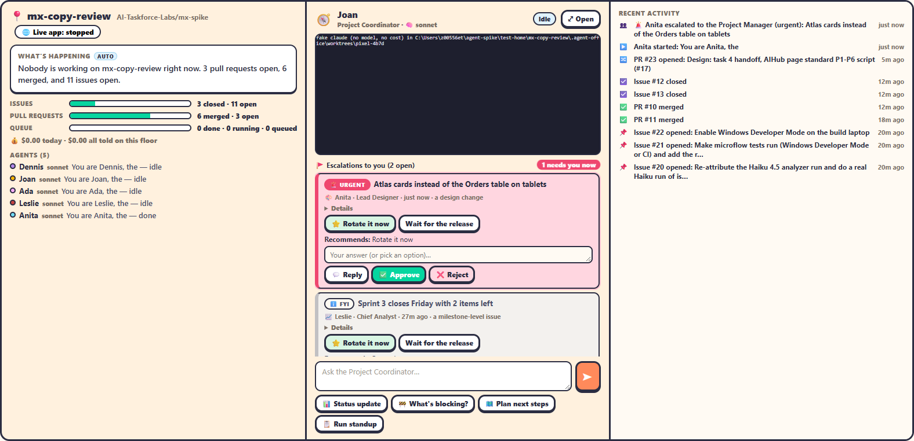
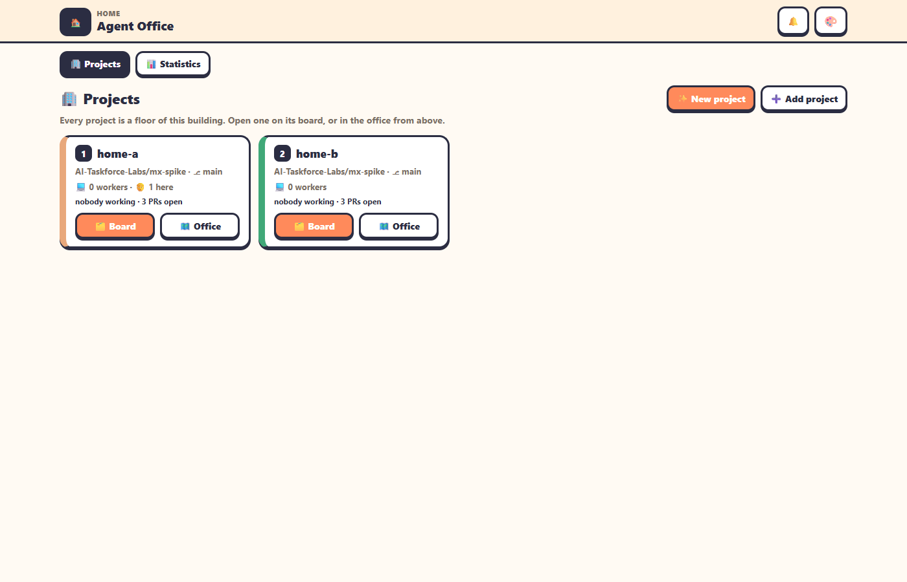
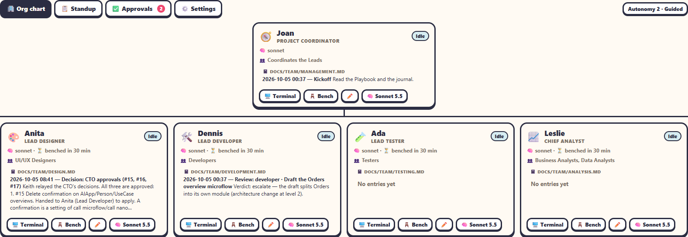
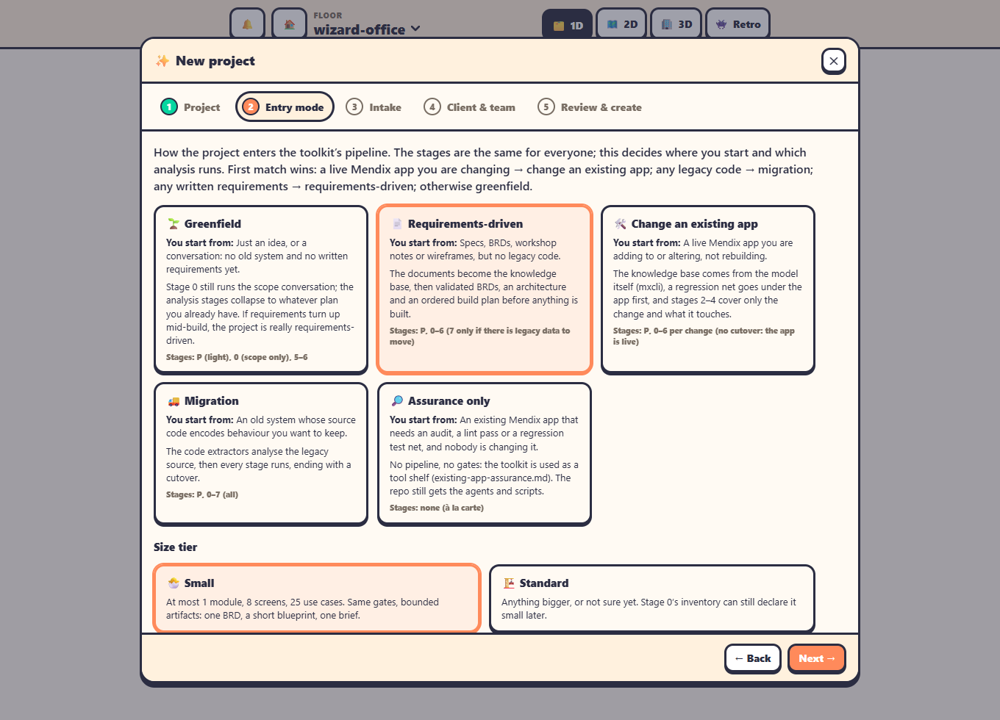
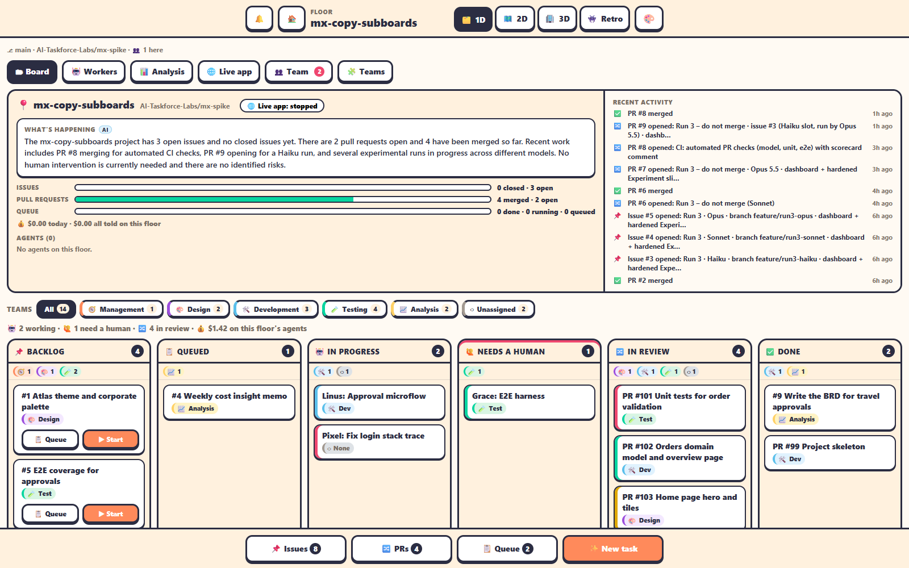

# Agent Office — the AI Taskforce Labs App Factory

> A shared office where **teams of AI agents build Mendix apps**, and you run them as their **Project Manager**.
> Built by the DI SW SEA AI Taskforce on top of the open-source [Agent Office](https://github.com/AgentSystemLabs/agent-office) (MIT).
> For a visual tour open **[README.html](README.html)**. The original project's documentation is in [docs/upstream-README.md](docs/upstream-README.md).



---

## Contents
1. [What it is](#1-what-it-is)
2. [Core ideas: building, floors, agents, views](#2-core-ideas)
3. [The team and its roles](#3-the-team-and-its-roles)
4. [How work flows](#4-how-work-flows)
5. [Using it day to day](#5-using-it-day-to-day)
6. [Building Mendix apps: mxcli, the toolkit, CI](#6-building-mendix-apps)
7. [Running it: start, sign in, tokens, restarts](#7-running-it)
8. [Troubleshooting](#8-troubleshooting)
9. [Where things are](#9-where-things-are)
10. [Glossary](#10-glossary)
11. [What's next](#11-whats-next)

---

## 1. What it is

Agent Office is a web app (a Node server on this laptop, a browser for you) where **Claude Code agents** sit at desks and work on **GitHub repositories**. Our version turns it into an **App Factory for Mendix**:

- Each **project** (a Mendix app in its own repo) is a **floor** of the building.
- Each floor has a **team**: a Project Coordinator and four Leads (Design, Development, Testing, Analysis), each a visible agent with its own Claude Code subagents.
- Agents build the app with **mxcli** (Mendix Labs' CLI: MDL scripts that edit the `.mpr` model) and follow the **mxcli-project-toolkit** (discovery → requirements → architecture → build plan → build → test).
- **You are the Project Manager.** You see everything from above (the Command Center), approve what matters, and answer escalations. How often agents need you is set by the **autonomy level**.
- Every pull request is checked automatically (Studio Pro's consistency check, lint, best-practice score, unit tests, Playwright UI tests), and the **live app** runs on the laptop so you can click through what the agents built.

It's a **digital twin of a hybrid software team**: what each agent is doing, what it costs, what's blocked, and what's waiting for a human, live.

---

## 2. Core ideas

| Idea | What it means |
|---|---|
| **Building / office** | The whole Agent Office: one server at `http://127.0.0.1:4600`, one password, all projects. |
| **Floor = project** | One GitHub repo (in the **AI-Taskforce-Labs** org), cloned on this machine. Each floor has its own board, queue, workers, team, live app and settings. Today: `mx-spike` (the SEA AI Hub) and `travel-approval`. |
| **Worker / agent** | A Claude Code session at a desk, usually in its own **git worktree** (its own copy and branch of the repo), so agents don't trip over each other. Every agent has a name, a model (Haiku 4.5 / Sonnet 5.5 / Opus 5.5 / Fable 5.1), a status and a cost. |
| **Board** | The project's Kanban: GitHub issues → queue → agents working → needs a human → PRs in review → done. Every card carries a **team tag**. |
| **Views** | The same office shown four ways: **1D** (boards and tabs, the default and most useful), **2D** (a pixel-art office from above with team zones), **3D** (walk around), **Retro** (3D in chunky pixels). |
| **Home** | `/home`: every project as a card, ✨ New project, and **📊 Statistics** across all projects. |



---

## 3. The team and its roles

```
                         You: the PROJECT MANAGER (human)
                    approve · answer escalations · set autonomy
                                      │
                         🧭 Project Coordinator (agent)
                  keeps the plan · runs the standup · relays to you
        ┌──────────────────┬──────────────┴───────┬──────────────────┐
  🎨 Lead Designer   🛠️ Lead Developer      🧪 Lead Tester      📈 Chief Analyst
   UI/UX Designers      Developers              Testers         Business & Data Analysts
   (subagents)          (subagents)             (subagents)            (subagents)
```

| Role | Mission | Its team (Claude Code subagents) | Toolkit skills it works from (examples) |
|---|---|---|---|
| **Project Manager — you** | Final say. Approve proposals, merges and milestones; answer escalations. | — | — |
| **🧭 Project Coordinator** | Keeps the plan, coordinates the Leads, runs the daily standup, summarises escalations for you. | — | conversion-runbook, iterative-build-loop, close-the-loop |
| **🎨 Lead Designer** | Reviews and approves design changes; Atlas design system, wireframes, page layouts. | UI/UX Designers | design-artifacts, ui-review-loop, learned-page-patterns |
| **🛠️ Lead Developer** | Does all programming. **The only one who writes to the Mendix model** (`mxcli exec`). | Developers (draft and `mxcli check` MDL) | architecture-blueprint, walking-skeleton, mdl-cookbook-microflows, mendix-agents |
| **🧪 Lead Tester** | Approves testing, improves the test framework. Mission: minimal bugs, highest quality. | Testers (unit `tests/*.test.mdl`, Playwright `tests/e2e`) | testing-shape, e2e-harness-base, journey-proof |
| **📈 Chief Analyst** | High-quality business requirements (the BRD), analysis of each app's development cycle, R&D. Writes a weekly insight memo. | Business Analysts, Data Analysts | interview-protocol, brd-generation, app-analysis |

**Rules every role follows** (written into its *Playbook*, `.ai-context/skills/team-<role>/SKILL.md` in the project):

- **One writer per Mendix app.** Only the Lead Developer applies changes to the `.mpr`. Everyone else drafts, checks and reviews.
- **Review loop.** When a subagent finishes, its Lead reviews the result (runs the cheap checks, writes a *Review* entry in the team journal), then **continues, sends it back, or escalates**. The office nudges a Lead that stops right after a subagent came back, so nobody sits idle.
- **Team journals.** Each team writes dated entries to `docs/team/<team>.md` (kickoffs, reviews, handoffs, proposals).
- **Benching.** An agent idle for 30 minutes (adjustable) first writes a **handoff note** and its **lessons**, then its session is cleared to save resources. Re-hiring starts fresh from the Playbook and that note.
- **Names and models are per project.** Each role has a fixed name you can rename, and a model you pick in the hire window (dropdown) or with the 🧠 button.

### Autonomy: how often agents need you

| Level | Leads escalate to you… |
|---|---|
| **1 Directive** | every outcome that changes scope, design or plan, and before every next step |
| **2 Guided** *(default)* | design, architecture or scope changes; work failing review twice; anything blocking |
| **3 Delegated** | milestone issues, repeated failures, budget risk |
| **4 Autonomous** | only critical: security, data loss, client-facing milestones, budget overrun, blocked with no way forward |

Whatever the level, **you have the final say**, and anything critical always reaches you. An optional **daily cost cap** pauses hiring on a floor once it's spent.

### Jeff, the quick judge

**Jeff · Router** is staff, not an agent: the office's quick judge, powered by **Jev** (TypeSafe AI's fast "System One" model that answers typed questions about a piece of text). He routes two things: when an agent ends its turn, *is it waiting on you?*; when a new issue appears, *which team is it for?* Each is Off, **Shadow** (the default: he is watching, not acting, and logs his verdict next to the office's own rule) or **On** (he raises the escalation the agent forgot, or labels the unlabelled issue he's sure of), in **⚙️ Settings → Jeff · Router**. The Analysis tab's **Jeff · Router** section shows where he agrees with the office; switch to On where he agrees with you. He sits beside the Project Coordinator on the org chart and in his own glass room on the 2D view.

His key: the launcher reads `~/.agent-office-jev-key` and passes its path as `AGENT_OFFICE_JEV_KEY_FILE` (or set `TYPESAFE_API_KEY`); workers never get it. With a key, agents' last messages and issue text (redacted of tokens, clipped to 4000 characters) go to TypeSafe; without one, or while Jev is failing, he runs on Claude Haiku ("Jeff (on Haiku)"). Details: [docs/teams.md](docs/teams.md#jeff-the-router).



---

## 4. How work flows

```
 GitHub issue ──▶ Backlog ──drag──▶ Queued / In progress ──▶ agent in its worktree
                                                                 │  (mxcli: MDL → model)
   Live app ◀── merge ◀── 🔀 In review: PR + CI scorecard ◀──────┘
 (restarts on new main)          ▲
                                 └── 🙋 Needs a human: questions, permissions, escalations
```

1. **Work is a GitHub issue.** It lands in **Backlog**, tagged with a team (`team:design`, `team:development`, …).
2. **Start it:** drag it to **In progress** (the hire window opens: pick the model) or to **Queued** (the next free agent takes it). Leads also pick up their team's work.
3. **The agent works in its own worktree**: MDL scripts through mxcli, checks, tests, then a **pull request**.
4. **CI runs on every PR** and posts a **scorecard**: Studio Pro consistency check, lint, best-practice score, unit tests, Playwright UI tests, plus screenshots. You see it when hovering the PR card.
5. **You (or the Lead, depending on autonomy) merge.** The project's **🌐 Live app** updates itself to the new `main` within about a minute.
6. Anything that needs you appears in **🙋 Needs a human**, **✅ Approvals** and as **escalation cards** in the Command Center.

---

## 5. Using it day to day

### Starting a project
**🏠 Home → ✨ New project** opens a wizard:
1. **Project**: name, org (AI-Taskforce-Labs), Mendix version.
2. **Entry mode**: Greenfield, Requirements-driven, Change an existing app, Migration or Assurance only, plus small/standard size.
3. **Intake**: the toolkit's kickoff questions as a form.
4. **Client & team**: who the client is, which roles to staff.
5. **Review & create**: creates the repo, adds the floor, runs the toolkit setup, records decisions, pushes, and can open a Discovery issue for the Chief Analyst.

New projects show a **Project setup** panel (toolkit stages P–4 with pass/pending) until the build plan is approved. **➕ Add project** adds an existing repo instead.



### Inside a project (the 1D view)
| Tab | What it's for |
|---|---|
| **🎛️ Command Center** *(default)* | Project details and "What's happening" · the **Project Coordinator console** (live terminal, *Ask the Project Coordinator…*, quick chips, **escalation cards** with Reply/Approve/Reject) · recent activity. |
| **🗂 Board** | Just the Kanban. Team filter chips, team tags, hover a card for its preview (live terminal for agents, scorecard and screenshots for PRs). |
| **🤖 Workers** | Every agent on the floor, the ones waiting on you first. |
| **📊 Analysis** | Which model does well on what task type, for this project or all; recent runs with cost, time and quality. |
| **🌐 Live app** | The Mendix app running from `main`, embedded. ▶ Start / ⟳ Restart / ■ Stop (admin). |
| **🏢 Org chart** | The team: hire (with model dropdown), wake, bench, rename, change model, open terminal. |
| **📋 Standup** | The latest standup (weekdays 09:00 SGT when there was activity, or on demand); approve/reject/change each proposal. |
| **✅ Approvals** | Everything waiting for the Project Manager: proposals and escalations (badge shows the count). |
| **⚙️ Settings** | Autonomy level, idle-to-bench minutes, standup schedule, review-loop nudge, cost caps. |
| **🧩 Team boards** | A page per team: its own board, its Lead, journal and team panels (Testing: CI scorecards; Development: PRs and live app; Analysis: BRD, insight memos, model ranking; …). |



### Handy things
- **The address says where you are:** `/lite?floor=travel-approval&tab=standup`, or `&tab=teams&team=testing`. Bookmark or share it.
- **🎨 Themes** (1D top bar): **Default**, **Dark**, **Terminal** (black and phosphor green). Remembered per browser.
- **Views:** 1D / 2D / 3D / Retro buttons in the top bar. 2D has team zones (Dev bay, Design studio, QA lab, Analyst corner, Coordinator office); click an agent for its terminal, right-click for its menu, **N** jumps to the next agent waiting on you, **T** chats.
- **Talking to agents:** the Command Center console prompts the Project Coordinator. Click any agent's card for its terminal. A question or permission prompt is answered **in the terminal**.


---

## 6. Building Mendix apps

| Piece | Role |
|---|---|
| **mxcli** (Mendix Labs, nightly) | Agents read and change the Mendix model through **MDL** scripts; `mxcli check`, `lint`, `report`, `test`, `run --local`. Validated on Mendix **11.6.x**; our projects use **11.6.4**. |
| **mxcli-project-toolkit** (Maurits / MendixMau; our private copy in AI-Taskforce-Labs) | The process: stages **P** kickoff → **0** triage ✋ → **1** analysis → **2** requirements → **3** architecture & design ✋ → **4** build plan ✋ → **5** build → **6** test → **7** cutover. ✋ gates need a `CONFIRMED` decision in `PROJECT.md`. Includes 120+ skills the roles read. Our copy fixes a Windows bug where commits hung in its pre-commit hook. |
| **Playbooks** | Per-project agent instructions: `mxcli-field-lessons` (hard-won lessons: reserved names, MDL pitfalls, Windows limits), `qa-tests` (how to write tests), and one per team role. |
| **CI pipeline** (`.github/workflows/pr-checks.yml`) | On every PR: Studio Pro `mx check`, `mxcli lint`, best-practice score, `mxcli test` unit tests, Playwright UI tests against the running app, one sticky **scorecard** comment, screenshots as artifacts. About 5 Actions minutes per run. |
| **Live app** | `mxcli run --local` from a separate clone of `main`, on ports **8110–8199**, database `<floor>_live` in the local PostgreSQL. |


---

## 7. Running it

- **Start:** the **Agent Office** desktop/taskbar icon (opens the office, starting it if needed), or ask Claude Code *"Run Agent Office"*. The office runs in a window titled **Agent Office**; closing it stops the office and its agents.
- **Open:** `http://127.0.0.1:4600` (lands on `/home`). Sign in with the office password.
- **Who's admin:** anyone using the shared office password, i.e. you, the Project Manager. Hiring, benching, approvals, settings and the live app are admin-only.
- **Tokens** (never paste them anywhere, never commit them):
  - `~/.agent-office-gh-token`: the **agents' token**. Fine-grained, owner **AI-Taskforce-Labs**, all repos, Contents / Issues / Pull requests read and write. Can't create or delete repos.
  - `~/.agent-office-admin-gh-token`: the **admin token**, used only by the server when the wizard creates a repo. Agents never see it.
  - `~/.agent-office-password`: the office password.
- **Restarts:** on Windows, restarting the office **stops all running agents** (they're children of the server). Their sessions are saved: open an asleep (💤) agent to wake it with its memory.
- **Models and cost:** pick per role or task. In our runs, **Sonnet 5.5** gave the best value, **Opus 5.5** the highest quality, and **Haiku 4.5** struggled with Mendix work. The Analysis tab and Home → Statistics track this.

---

## 8. Troubleshooting

| Symptom | Fix |
|---|---|
| An agent is stuck "waiting on a setup prompt (trust / login)" | Open its terminal and accept Claude Code's *trust this folder* question once. |
| 3D view laggy | Use 1D or 2D for daily work. Edge is set to the NVIDIA GPU; in 3D try `?gfx=low` or the Retro view. |
| Live app won't start: "Address already in use" | Another process holds the port; the office picks free ports from 8110–8199 (restart the live app). |
| Live app: "initial build failed: Object reference not set…" after an update | Stale build output; the office clears `deployment/` build folders and retries once automatically. |
| Live app / mxcli: "A required privilege is not held by the client" | Windows symlink rights: create the directory junction mxcli names (`cmd /c mklink /J <link> <target>`), or enable Developer Mode. |
| Commits hang in a toolkit project | Use our toolkit copy (fixed). Run git with stdin closed in scripts. |
| GitHub emails about failed runs | The fork's CI runs the full test suite on every push to `main`; an email means something broke. It never publishes releases. |
| Floors missing after a restart | Fixed (the team hook no longer breaks floor start-up). If it ever recurs, check the Agent Office window for errors. |

---

## 9. Where things are

| What | Where |
|---|---|
| This app (our fork) | `C:\Users\z00556et\agent-spike\agent-office-src` · github.com/keithchin/agent-office (private) |
| Launcher / desktop shortcut | `agent-spike\start-office.ps1`, `agent-spike\open-agent-office.ps1`, icon `agent-office.ico` |
| Office data (password hash, floors, roster, analysis) | `agent-spike\mx-spike\.agent-office\` |
| Projects (floors) | `agent-spike\mx-spike` (AI-Taskforce-Labs/mx-spike) · `agent-office\AI-Taskforce-Labs\travel-approval` |
| Toolkit (our copy) | `agent-spike\mxcli-project-toolkit` · AI-Taskforce-Labs/mxcli-project-toolkit (private; `upstream` = MendixMau, push disabled) |
| mxcli | `agent-spike\bin\mxcli.exe` (nightly) |
| Scripts | `agent-spike\queue-runs.mjs` (queue issues with a model), `add-floor.mjs`, `token-check.mjs` |
| Docs | [docs/teams.md](docs/teams.md) (team model in depth), [docs/features.md](docs/features.md), [docs/configuration.md](docs/configuration.md), [docs/upstream-README.md](docs/upstream-README.md) |

---

## 10. Glossary

- **Floor**: a project (one repo) in the office.
- **Worker / agent**: a Claude Code session at a desk.
- **Worktree**: an agent's own checkout and branch of the repo.
- **Lead**: the visible agent heading a team. **Subagent**: a team member running inside a Lead's session.
- **Project Coordinator**: the agent that coordinates the Leads. **Project Manager**: you.
- **Playbook**: a skill file with a role's or project's instructions.
- **MDL**: Mendix Definition Language, the text format mxcli uses to change a Mendix model.
- **✋ Gate**: a toolkit milestone that needs an explicit `CONFIRMED` decision.
- **Bench**: clear an idle agent's session after it has written a handoff note.
- **Escalation**: a structured question from an agent to you, with urgency, options and a recommendation.
- **Scorecard**: the CI comment on a PR summarising checks, score and tests.

---

## 11. What's next

- **Plan → issues bridge**: turn the toolkit's approved build plan into GitHub issues for the team automatically.
- **Client portal**: a restricted Client role for each project to see progress, test the app and approve milestones (the toolkit's ✋ gates).
- **Taskforce Lab on AWS** (Phase 2): the office on a shared Linux server for the five Taskforce members, a GitHub App instead of personal tokens, and a proxy so the live app works from other machines.
- **Effort per role**, and product agents (Teamcenter, RapidMiner) as additional teams.

*Agent Office is MIT-licensed by AgentSystemLabs; this fork adds the App Factory, the team model and the Mendix pipeline for the DI SW SEA AI Taskforce.*
