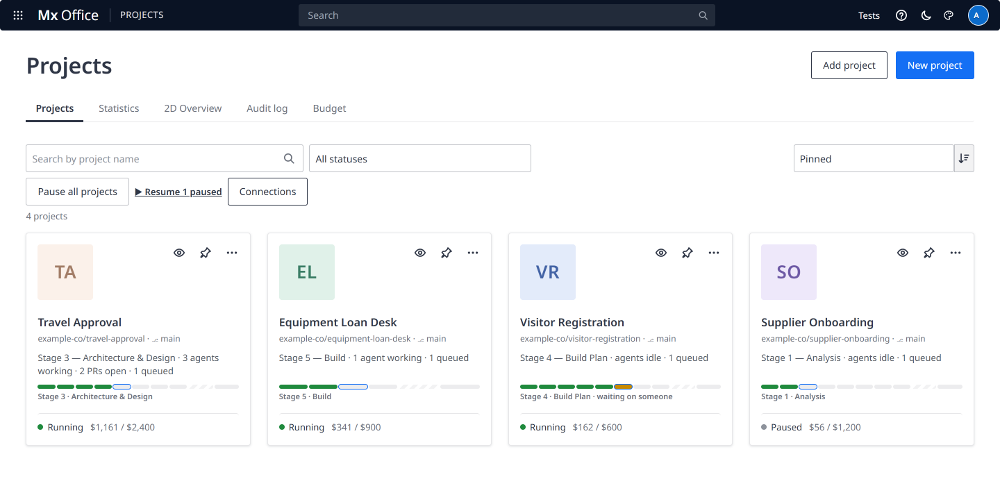

# Mx Office — the AI Taskforce Labs App Factory

> A shared office where **teams of AI agents build Mendix apps**, and you run them as their **Project Manager**.
> Built by the DI SW SEA AI Taskforce on top of the open-source [Agent Office](https://github.com/AgentSystemLabs/agent-office) (MIT).

- **📚 Full documentation:** in the office at **`/docs`** (`http://127.0.0.1:4600/docs`; also ☰ → 📖 Documentation, or 📚 Docs on Home).
- **📝 What changed:** [CHANGELOG.md](CHANGELOG.md), the single source of the release notes (the *Release notes* page in `/docs` shows this file).
- **🖼️ Visual tour:** [README.html](README.html).
- **⬇️ Releases:** every release has its notes on the [GitHub releases page](https://github.com/keithchin/mx-office/releases).


## What it is

Mx Office is a web app (a Node server on your machine, your browser as the screen) where **Claude Code agents** work on **GitHub repositories**. It started as a fork of Agent Office and turns it into an **App Factory for Mendix**:

- Every **project** is one Mendix app in its own GitHub repository (in the organization you pick in setup; AI-Taskforce-Labs by default), with two views: its **1D view** (`/lite`: the Overview, board and the other pages, where every project opens) and its **2D Office view** (`/pixel`: the floor from above in pixel art, from **Go to Office**; **Return to Project** comes back). The old 3D and Retro views are gone; `/` and old `/?view=3d` links open the 1D view.
- Every floor has a **team** in one of three shapes: **Enterprise**, a **Project Coordinator** and four **Leads** (Design, Development, Testing, Analysis), each with its own Claude Code subagents; **Startup**, a Chief Analyst and a Lead Developer; or **Solo**, one Solo Lead covering every team. The new-project wizard recommends a shape and a budget level from the intake answers.
- The agents change the app with **mxcli** and follow the **mxcli-project-toolkit**, stages P (kickoff) to 7 (cutover), with ✋ gates that need a `CONFIRMED` decision.
- **You are the Project Manager**: you approve what matters and answer escalations. The **autonomy level** (1 Directive … 4 Autonomous) sets how often agents need you.
- Every pull request gets CI (consistency check, lint, best-practice score, unit and Playwright tests, screenshots), and the **live app** runs from `main` on your machine, so you don't have to open Studio Pro to see it running.

What a project gives you:

- **🧭 Overview** (the Command Center): what needs you, the Project Coordinator's console, recent activity, and Team, Technical contact and Details cards, under a **progress bar** of the toolkit's stages and ✋ gates with real counts (a gate waiting only on your sign-off says **NEEDS SIGN-OFF**, not FAIL).
- **📐 Model**: an App Explorer and the app's domain models, microflows and nanoflows drawn the way Studio Pro draws them, from the model itself, at the developer's own positions; per branch, with what an agent changed highlighted, a Tidy layout for messy domain models, and full screen.
- **✅ Accept a delivery**: review the committed evidence at one delivery revision, exceptions with owners and a frozen cost. Confirmation requires the reviewed draft to still match; reopening starts v1.1 and keeps the old record.
- **🧰 Pinned toolkit**: each project runs on its own mxcli-project-toolkit commit; **Update toolkit** previews what would change at the gates (Stage 2 PASS → FAIL, and why) before it commits, and can roll back.
- **🤫 Interruptions handled**: every office message ends with "carry on with" the agent's task; an agent that stops with work open gets one nudge; **Run standup** or a status question first shows who's ready and who's busy, and asks before interrupting.
- **🗑 Delete a project**, GitHub-style: a Danger zone in Settings, remove from the office or delete (optionally the folder and the GitHub repo), confirmed by typing its name; its data is archived first and the audit log keeps the record.



Around the projects:

- **🧑‍⚖️ Jeff · Router**, the office's quick judge (Jev, with Claude Haiku as fallback): is an agent waiting on you, which team is a new issue for, and which escalation to resolve first.
- **🏛️ The Firm** (`/firm`): independent Reviewer Agents that audit a project from outside its team and deliver one report to you.
- **🧾 Audit log**: who did what and when, per floor and office-wide, hash-chained, with **🚨 Incidents**: what went wrong or nearly did, with cause and follow-up, opened by hand or by the office's detection rules.
- **Test mode** (`--test-mode`, and by itself under `scratch/test-offices` or a folder named `test-office…`): a test office never starts a real agent CLI (`claude`, `codex`, `opencode`, `grok`…), only its fake `--agent`, and refuses a real CLI given as one. The office's own Claude calls (Jeff, the analyzer, task names) are refused there too.
- **Performance guard and the Test Mode page** (admins, `/lite?tab=tests`, from ☰ › 🧪 Test mode, Home or ⚙️ Settings › 🧪 Testing): run the unit tests, the page-responsiveness test (every main view on a big synthetic office with live fake workers: longest task 200 ms, usable in 3 s, project switch 1.5 s, no memory growth), the end-to-end journey and the Command Center check against a throwaway test office, and read the results, charts and history (`/docs/administration/test-mode-page`, `/docs/administration/performance-budgets`). A page that freezes over half a second, or a server stall over a second, opens an incident.
- **💰 Budget**: what each project spent, in dollars and a local currency, against an expected plan and a budget with a forecast, alerts and an auto-pause at 100 %, three budget levels in the new-project wizard, cost insights, and chips in the top bar.
- **💬 Team chatter**: what the agents say to each other, as a live thread on each Command Center.
- **🏢 Go to Office**: the 2D office view, where the agents sit and walk around, a button away from every project.
- **📱 Team phone**: a floating chat and notification centre on the project and office views (a pixel iPhone in the Fun theme): each project's team chatter as a channel, DMs and threads with the agents, messages to the Project Coordinator, `@Name` or `@team`, and everything that needs you with its buttons.
- **📱 Phone version and Phone access**: the team phone full screen at `/m`, installable on an iPhone with push notifications for what needs you, and a private tunnel to it (Microsoft Dev Tunnels, or Cloudflare Tunnel with Access) switched on from 🔌 Connections. See the docs: *Phone version* and *Phone access*.
- **🎨 Seven color themes**: Portal (Light) / Portal (Dark), the default, drawn like a low-code platform's web portal (navy top bar with a launcher and a search over projects, pages, agents, issues, pull requests and the docs; a project's pages in a left navigation of collapsible groups that folds to an icon rail, with a page header and an app-overview Overview; Home as a Projects card grid); Clean (Light) / Clean (Dark), which look like VS Code; both pairs show no emoji. And Fun, Fun (Dark) and Terminal.

## Quick start

On a fresh Windows machine (Node.js 22.5+, Git, `gh`, Claude Code, Studio Pro and mxcli installed; the office checks each one for you):

```powershell
git clone https://github.com/keithchin/mx-office.git
cd mx-office
npm install
npm run build
.\scripts\start-office.ps1
```

1. **Start**: `scripts\start-office.ps1` keeps the office's data in `%USERPROFILE%\mx-office` (`-OfficeHome` for another folder, `-Port` for another port than 4600), builds it if `dist` is missing, opens it in your browser signed in, and restarts it after **🔁 Restart safely**. Keep its window open: closing it stops the office and its agents. `scripts\install-shortcut.ps1` adds a **Mx Office** shortcut to the desktop and Start menu.
2. **Set it up**: a new office opens on **🚀 First-run setup** (`/setup`): the office password, a prerequisites check with install links, GitHub (the organization new projects go in, and the two tokens), Mendix (token and default Studio Pro), and the toolkit (pick a folder or clone it). Signing in with the office password makes you admin: the Project Manager. The full walkthrough: `/docs/get-started/new-machine` ([docs/site/get-started/new-machine.md](docs/site/get-started/new-machine.md)).
3. On **🏠 Home**, open a project's **🗂️ Board**, or click **✨ New project** to create a Mendix app with the wizard.
4. In the project, **🏢 Org chart → 🤝 Hire** the Project Coordinator (Sonnet 5.5 is a good default), then the Leads you need.
5. On **🎛️ Command Center**, ask the Coordinator for the first plan, and answer what shows up in **🚨 Needs you** and **🚩 Escalations to you**.

The step-by-step version, with screenshots: `/docs/get-started/quick-start`.

> **Tokens** are managed in the office: **☰ → 🔌 Connections** (admins) keeps the agents' and admin GitHub tokens, the Mendix token, the Jev key and the office password, encrypted with Windows DPAPI, with a Test button each. The old files still work as a fallback (`~/.agent-office-gh-token`, `~/.agent-office-admin-gh-token`, `~/.agent-office-jev-key`) and **📥 Import from files** moves them in. Never paste a token anywhere else.
>
> **Restarts** on Windows stop running agents; their sessions are saved, the ones cut off mid-turn carry on, and the rest stay asleep until they're prompted (or you press R). **▶ Resume project** wakes the ones with work waiting, a few at a time, and **⏸ Pause project** winds a project down cleanly before a restart; **🔁 Restart safely** (⚙️ Settings › Agents, `/lite?tab=settings&section=workers`) does both around a restart, given the launcher's restart loop (`/docs/using-the-office/resume-and-pause`, `/docs/administration/running-the-office`). To try a change, run a throwaway **test office** on a 47xx port with its own `AGENT_OFFICE_HOME` and throwaway floors, never the real ones (`/docs/administration/test-offices`).
>
> **Away from the laptop**: the office keeps Windows awake while agents work (set *When I close the lid* to *Do nothing* when plugged in to close the lid; `/docs/administration/running-the-office`), and can post what needs you to a **Microsoft Teams** channel through a Workflows webhook (⚙️ Settings › Notifications, `/lite?tab=settings&section=notify`; `/docs/integrations/teams-notifications`).

## Where to read more

| You want… | In `/docs` |
|---|---|
| Your way around the screens | Get Started → A tour; Using the Office (one page per tab, Home, the Audit log, The Firm) |
| The team model, autonomy, escalations, benching, models and costs | Teams & Agents |
| Jeff, skills and gates, the subagent track record | Automation |
| GitHub, mxcli, the toolkit, the CI pipeline | Integrations |
| Running, restarting, tokens, data locations, test offices | Administration |
| `office-workers` commands, API routes, settings, shortcuts, glossary | Reference |
| Something went wrong | Troubleshooting and the FAQ |
| What changed | Release notes ([CHANGELOG.md](CHANGELOG.md)) |

The pages are Markdown under [`docs/site/`](docs/site/) (the home page is [`docs/site/_index.md`](docs/site/_index.md)), built into the office by `npm run build`. See *Administration → Writing these docs*.

## Development

```sh
npm install
npm run build        # client, server and the /docs bundle
npm run typecheck
npm test             # every test file, a few at a time, each with time limits (about 2 min)
npm run test:one tests/docs-site.test.ts   # one test file
npm run test:perf:quick   # the performance guard's quick check: main views and the journey (a few minutes)
npm run test:perf    # the whole performance guard: every view with a 60 s soak, and the journey
```

Before committing a change to the pages or the server, run `npm test` and `npm run test:perf:quick`; both run on Windows too. The performance runs use a throwaway test office under `scratch\test-offices` with fake agents only (see `/docs/administration/performance-budgets`).

**Release notes:** add what changed under **Unreleased** in [CHANGELOG.md](CHANGELOG.md); it becomes a release when the office restarts on it. Don't edit `docs/site/release-notes.md`: it only points at the changelog.

---

*Agent Office is MIT-licensed by AgentSystemLabs; Mx Office adds the App Factory, the team model, Jeff, The Firm and the Mendix pipeline for the DI SW SEA AI Taskforce. The original project's README is [docs/upstream-README.md](docs/upstream-README.md).*
