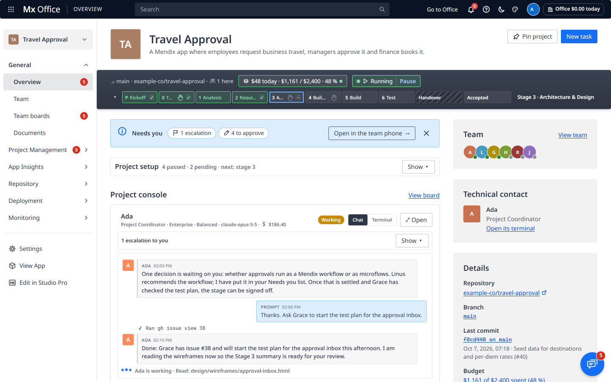

# Agent Office — the AI Taskforce Labs App Factory

> A shared office where **teams of AI agents build Mendix apps**, and you run them as their **Project Manager**.
> Built by the DI SW SEA AI Taskforce on top of the open-source [Agent Office](https://github.com/AgentSystemLabs/agent-office) (MIT).

- **📚 Full documentation:** in the office at **`/docs`** (`http://127.0.0.1:4600/docs`; also ☰ → 📖 Documentation, or 📚 Docs on Home).
- **📝 What changed:** [CHANGELOG.md](CHANGELOG.md), the single source of the release notes (the *Release notes* page in `/docs` shows this file).
- **🖼️ Visual tour:** [README.html](README.html).



## What it is

Agent Office is a web app (a Node server on this laptop, your browser as the screen) where **Claude Code agents** sit at desks and work on **GitHub repositories**. Our fork turns it into an **App Factory for Mendix**:

- Every **project** (one Mendix app in its own repo in **AI-Taskforce-Labs**) is a **floor** of the building.
- Every floor has a **team**: a **Project Coordinator** and four **Leads** (Design, Development, Testing, Analysis), each with its own Claude Code subagents.
- The agents change the app with **mxcli** and follow the **mxcli-project-toolkit**, stages P (kickoff) to 7 (cutover), with ✋ gates that need a `CONFIRMED` decision.
- **You are the Project Manager**: you approve what matters and answer escalations. The **autonomy level** (1 Directive … 4 Autonomous) sets how often agents need you.
- Every pull request gets CI (consistency check, lint, best-practice score, unit and Playwright tests, screenshots), and the **live app** runs from `main` on the laptop.

Around the teams:

- **🧑‍⚖️ Jeff · Router**, the office's quick judge (Jev, with Claude Haiku as fallback): is an agent waiting on you, which team is a new issue for, and which escalation to resolve first.
- **🏛️ The Firm** (`/firm`): independent Reviewer Agents that audit a project from outside its team and deliver one report to you.
- **🧾 Audit log**: who did what and when, per floor and office-wide, hash-chained.
- **📱 Team phone**: a floating chat and notification centre on the 1D and 2D views (a pixel iPhone in the Default theme): each project's team chatter as a channel, DMs and threads with the agents, messages to the Project Coordinator, `@Name` or `@team`, and everything that needs you with its buttons.
- **🎨 Five color themes**: Default, Dark, Terminal, and Clean (Light) / Clean (Dark), which look like VS Code and show no emoji.

## Quick start

1. **Start** the office with the **Agent Office** desktop/taskbar icon (it starts `agent-spike\start-office.ps1` if the office isn't up), or ask Claude Code *"Run Agent Office"*. Keep its window open: closing it stops the office and its agents.
2. **Open** `http://127.0.0.1:4600` and sign in with the office password (kept in `~/.agent-office-password`). Signing in with it makes you admin: the Project Manager.
3. On **🏠 Home**, open a project's **🗂️ Board**, or click **✨ New project** to create a Mendix app with the wizard.
4. In the project, **🏢 Org chart → 🤝 Hire** the Project Coordinator (Sonnet 5.5 is a good default), then the Leads you need.
5. On **🎛️ Command Center**, ask the Coordinator for the first plan, and answer what shows up in **🚨 Needs you** and **🚩 Escalations to you**.

The step-by-step version, with screenshots: `/docs/get-started/quick-start`.

> **Tokens** live in files and are referred to by path only: `~/.agent-office-gh-token` (the agents'), `~/.agent-office-admin-gh-token` (repo creation only), `~/.agent-office-jev-key` (Jeff's, passed as `AGENT_OFFICE_JEV_KEY_FILE`). Never paste their contents anywhere.
>
> **Restarts** on Windows stop running agents; their sessions are saved, the ones cut off mid-turn carry on, and the rest stay asleep until they're prompted (or you press R). To try a change, run a throwaway **test office** on a 47xx port with its own `AGENT_OFFICE_HOME` and throwaway floors, never the real ones (`/docs/administration/test-offices`).

## Where to read more

| You want… | In `/docs` |
|---|---|
| Your way around the screens | Get Started → A tour; Using the Office (one page per tab, Home, the Audit log, The Firm) |
| The team model, autonomy, escalations, benching, models and costs | Teams & Agents |
| Jeff, skills and gates, the subagent track record | Automation |
| GitHub, mxcli, the toolkit, the CI pipeline | Integrations |
| Running, restarting, tokens, data locations, test offices | Administration |
| `office-workers` commands, API routes, settings, shortcuts, glossary | Reference |
| Something went wrong | Troubleshooting and the FAQ |
| What changed | Release notes ([CHANGELOG.md](CHANGELOG.md)) |

The pages are Markdown under [`docs/site/`](docs/site/) (the home page is [`docs/site/_index.md`](docs/site/_index.md)), built into the office by `npm run build`. See *Administration → Writing these docs*.

## Development

```sh
npm install
npm run build        # client, server and the /docs bundle
npm run typecheck
node --import tsx --import=#tests/css --test tests/docs-site.test.ts   # one test file
```

On Windows, run the test files you touched rather than the whole `npm test`.

**Release notes:** add what changed under **Unreleased** in [CHANGELOG.md](CHANGELOG.md); it becomes a release when the office restarts on it. Don't edit `docs/site/release-notes.md`: it only points at the changelog.

---

*Agent Office is MIT-licensed by AgentSystemLabs; this fork adds the App Factory, the team model, Jeff, The Firm and the Mendix pipeline for the DI SW SEA AI Taskforce. The original project's README is [docs/upstream-README.md](docs/upstream-README.md).*
