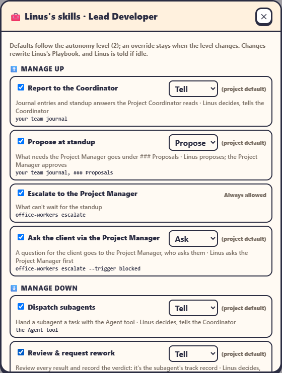

Each team member has **🧰 Skills**: what it may do, and how. Open them with **🧰 Skills** on its card in the [Org chart](../using-the-office/org-chart.md).

## Gates

Every skill that changes something has a **gate**:

| Gate | Means |
|---|---|
| **Ask** | It raises an escalation; the action happens only once you approve. |
| **Propose** | It goes into your **✅ Approvals**. Your decision goes back to the member: straight away between its turns, or kept as a note for when it's back at its desk. |
| **Tell** | The member decides; the Project Coordinator is told (batched a minute after the last one, kept through a restart, skipped on a floor with no Coordinator). |
| **FYI** | The member decides; you get an FYI escalation. |

## The skills

| Group | Skill | Default gate at level 1 / 2 / 3 / 4 | How |
|---|---|---|---|
| ⬆️ **Manage up** (everyone) | report | tell | |
| | propose | propose | |
| | escalate | always allowed | `office-workers escalate` |
| | ask the client | ask | `escalate --trigger blocked` |
| ⬇️ **Manage down** (Leads) | dispatch a subagent | tell | the Agent tool |
| | review a result | tell | `subagent review` |
| | warn a subagent | propose / tell / tell / FYI | `subagent warn` |
| | bench a subagent | ask / propose / tell / FYI | `subagent bench` |
| | swap a subagent's model | ask / propose / tell / FYI | `subagent swap-model` |
| | reinstate a subagent | tell | `subagent reinstate` |
| ⬇️ **Manage down** (Coordinator) | nudge a Lead | tell | |
| | reassign a Lead | ask / propose / tell / FYI | |
| 🛠️ **Craft** | one per toolkit skill the role works from | always allowed | |

## Overriding

As admin you can, per member and per skill:

- turn the skill **on or off**;
- pick another **gate**: the window marks it *(override · default X)*;
- **↺ Reset** to the project default.

Changes rewrite the member's Playbook.

> [!NOTE]
> The office itself enforces the gates on the `office-workers subagent` operations. The other gates are instructions in the Playbook, which the agents follow.
