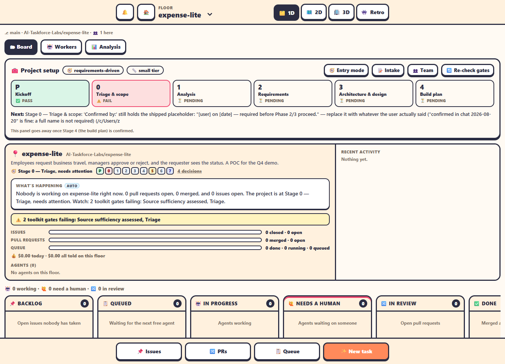

The **✨ New project** wizard on **/home** turns a few answers into a ready project: a private GitHub repository, a floor in the office, a blank Mendix app (`.mpr`), the toolkit's scaffold, recorded decisions, the project team at their desks and a Discovery issue for the Chief Analyst.

> [!NOTE]
> Only an admin (the Project Manager) can create a project. The wizard uses a separate **admin token** that can create repositories: `~/.agent-office-admin-gh-token`. The agents never see it. See [Security & tokens](../administration/security-and-tokens.md).

## Open the wizard

Go to **🏠 Home → 🏢 Projects** and click **✨ New project**. This browser tab keeps your answers while you work, so a reload doesn't lose them.

## Page 1: Project

- Choose **✨ A new project**, or **🛠️ Changes to an existing app** (then pick its repository).
- **Name**: becomes the repository name, in lower case with dashes.
- **Owner organization**: `AI-Taskforce-Labs` by default.
- **Description**, **Private repository** (on by default), and the **Mendix (Studio Pro) version**: the versions installed on the office's machine, with the newest 11.12 (11.12.4) picked by default (11.6.4, mxcli's validated line, when no 11.12 is installed). A new project's Mendix app is created with it. For an existing app that is already a floor, the wizard picks the version its `.mpr` was last saved with.
- Tick **I created this repository myself** if you made the repo by hand. The wizard then only checks that it exists.

## Page 2: Entry mode

Pick how the project starts. The toolkit adapts its stages to it.

| Entry mode | When |
|---|---|
| 🌱 Greenfield | A new app from an idea. |
| 📄 Requirements-driven | You already have requirements or a BRD. |
| 🛠️ Change an existing app | Changes to an app that exists. |
| 🚚 Migration | Moving an app from another platform. |
| 🔎 Assurance only | Review and test an app; no building. |

Then pick the **size tier**: 🐣 **Small** (at most 1 module, 8 screens and 25 use cases) or 🏗️ **Standard**.

## Page 3: Intake

The toolkit's kickoff questions, as a form. Mark each answer **Answered**, **Assumed** or **Unverified**. The wizard fills in three for you: Q1 (entry mode), Q9 (interview mode: **Steering**, every question asked and waited for, the default; **Assist**, questions batched at the gates and small ones assumed; or **Auto**, unattended: nothing blocks and every assumption is recorded. These are the toolkit's `interview-mode.sh` modes, written to `PROJECT.md` as `Interview mode:`) and Q11 (exec approval: auto or ask).

## Page 4: Client & team

- **Client name(s)** and **Operator(s)**.
- **Roles to staff**: all five are ticked. The ticked roles are **hired** on the new floor at the end of the setup, each with its fixed name, its Playbook and its role's model (change the model later on the Team tab), so the team is at its desks when you arrive.
- **Discovery**: open a *Discovery* issue for the Chief Analyst (on by default). With the Chief Analyst on the team, tick **Hand it to the Chief Analyst now** and it is hired with the issue as its first task, on the model you pick in **Chief Analyst's model for Discovery** (Opus by default; its role's own model on the Team tab stays as it is for later hires). Without it, tick **Queue it now for an agent** and pick the agent's model (Opus by default).

## Page 5: Budget

Choose how to trade cost against speed. There are three levels, plus Manual:

| Level | What it sets | Preset budget |
|---|---|---|
| 🪙 **Lean**: lowest cost | Leads and Discovery on Sonnet. Subagents on Haiku where the role allows it (the Developer, UI/UX Designer and Business Analyst stay on Sonnet). Early drafts off. Autonomy by stage on (Guided, then Delegated in build). Fewer agents at once. | 0.65 × the plan estimate |
| ⚖️ **Balanced**: the default | Leads on Sonnet, the Chief Analyst on Opus for Discovery, subagents on Sonnet. Early drafts on. | the plan estimate |
| 🚀 **Fast**: speed first | Leads on Opus, more agents and subagents in parallel. Early drafts on. Autonomy by stage on (Delegated, then Autonomous). | 1.6 × the plan estimate (Opus rates plus a 15 % margin) |
| ✍️ **Manual** | You type the budget and pick each setting yourself. | yours |

Each card shows:

- the preset total budget, in dollars and the local currency.
- the expected time (`~1.3×`, `~1.0×`, `~0.7×`), as a multiple of Balanced, with working days.
- what the level changes.
- the alert threshold.

The plan estimate comes from the project's tier and entry mode (see [Budget](../using-the-office/budget.md#the-expected-plan)). For example, a small requirements-driven project like travel-approval comes to **Lean $220, Balanced $330, Fast $530**.

Under the cards you can adjust:

- the total.
- the alert threshold (80 % by default).
- auto-pause at 100 %.

When the setup reaches its **Hire the project team** step, it saves the budget on the new floor first, then sets the Leads' and subagents' models and the team settings. Everyone is then hired on the level's choices. The Chief Analyst's Discovery model follows the level too. To change the level of a project that's already running, use its [Budget tab](../using-the-office/budget.md#budget-levels).

## Page 6: Review & create

Check the summary and click **✨ Create project**. A progress list runs each step. Every step can be retried, and a step that is already done is skipped.

1. Create the GitHub repository (`gh repo create`, private, with the admin token).
2. Clone it as a floor.
3. Write `.claude/toolkit.env` (MXBUILD_PATH, mxcli nightly, Python).
4. Create the Mendix app (new projects only): Studio Pro's own `mx create-project` makes a blank app named after the project (`travel-approval` → `TravelApproval.mpr`) at the repository's root, where the toolkit looks for it. Without `mx` in that Studio Pro it falls back to `mxcli new`. Mendix's generated files (`deployment/`, `.mendix-cache/`, `theme-cache/`, `*.mpr.lock` and so on) are added to `.gitignore`. An existing app is left alone; the step only reports which Studio Pro its `.mpr` was saved with.
5. Run the toolkit's `init-project.sh` (after the app, so its `CLAUDE.local.md` names the `.mpr`).
6. Install the pre-commit hook.
7. Write the intake answers to `intake.md`.
8. Record decisions in `PROJECT.md`: entry mode, size tier, Mendix version and interview mode, each `CONFIRMED` with today's date.
9. Save the client, operator and role settings in `agent-office.project.json` at the project's root. It is committed with the project, so every office that opens it sees the same client and team.
10. Refresh the gate dashboard (`gate-check.sh`).
11. Commit and push: the scaffold and the app in one commit.
12. Open the Discovery issue: *"Discovery: kickoff with the client (Stages P → 4)"*.
13. Hire the project team: the Project Coordinator and the Leads you ticked, the roster's way (the same as **Hire** on the Team tab). A role already at work is not hired again.
14. Queue the Discovery task for an agent (when you ticked it and the Chief Analyst isn't on the team; otherwise the Chief Analyst already has it).

If a step fails, fix the cause and click **🔁 Retry from the failed step**. **✏️ Edit answers** goes back to the form. When it's done, click **🗂️ Go to the floor**.

Editing the answers later (from the floor's **🧰 Project setup** panel) writes the intake answers, decisions and settings again and commits them. A role you tick that wasn't ticked before is hired too, but never one the floor already has in any state: at work, benched, or sent home on purpose. Unticking a role sends no one home. The Discovery issue isn't handed out again.

> [!NOTE]
> Agents, queue workers, **🔄 Re-check gates** and the live app all run with the project's `.claude/toolkit.env` over the office's own environment, so an 11.12.4 project builds with 11.12.4's mxbuild even when the office was started with an `MXBUILD_PATH` for another Studio Pro.

The setup is a [workflow](../automation/workflows.md): it is saved after every step, so an office restart halfway loses nothing (the step it was on shows as failed, and Retry carries on from it). The steps that talk to GitHub (create, clone, push, the issue) and creating the app try again by themselves, twice, when the connection drops or GitHub is busy; the log says *↻ … trying again in 3s*.

## After the wizard

The new floor's Command Center shows a **🧰 Project setup** panel with the toolkit's stages **P** to **4**. Each one is ✅ PASS, ⏳ PENDING, ⚠️ FAIL, ↷ WAIVED or ✋ MANUAL, and a ✋ stage waits for your sign-off. The panel goes away once Stage 4 (the build plan) is confirmed. See [The toolkit](../integrations/toolkit.md).

> [!TIP]
> The Discovery brief tells the Chief Analyst to stop at the ✋ gates 0, 3 and 4, and to record `CONFIRMED` only when the client says so. You confirm by answering its escalations.

## Add an existing repository instead

**➕ Add project** opens *Add a project*. Search your repositories or type `owner/name`. The office clones it with its own `gh` login and opens it as a floor. Admins can choose the folder with **📁 Change folder**.
