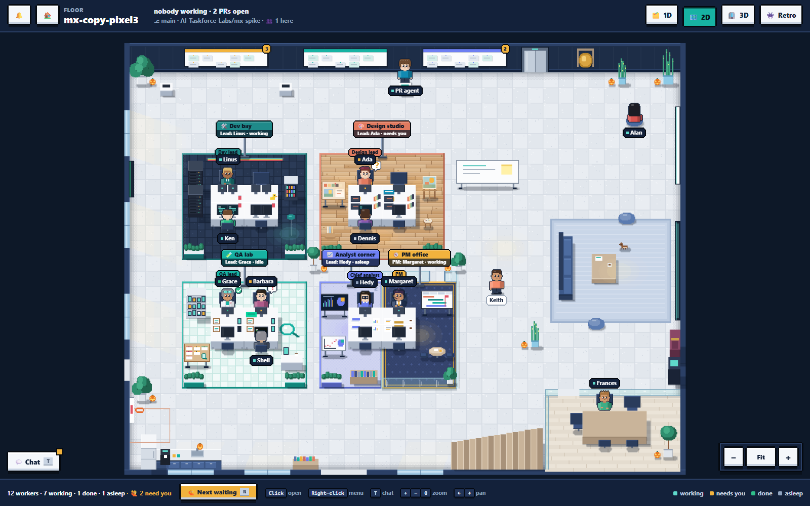

This page shows where everything is. Each screen has its own page under [Using the Office](../using-the-office/_index.md).

## The pages

| Address | What it is |
|---|---|
| `/home` | Every project as a card, office-wide **📊 Statistics**, a **🗺️ 2D Overview** of all floors, and the **🧾 Audit log** of the whole office. See [Home](../using-the-office/home.md). |
| `/lite?floor=<id>` | The **1D view** of one project, with a tab for everything. The default and most useful view. |
| `/pixel?floor=<id>` | The **2D view**: the floor from above in pixel art. See [2D view](../using-the-office/2d-view.md). |
| `/?3d=1&view=3d` | The **3D office**, where you walk around. `view=retro` draws it in chunky pixels. See [3D and Retro](../using-the-office/3d-view.md). |
| `/firm` | **🏛️ The Firm**: independent Reviewer Agents that audit a project and report to you. See [The Firm](../using-the-office/the-firm.md). |
| `/docs` | These docs. |

## The top bar

On the 1D and 2D views, left to right: **🏠** (home), the **floor** picker, the **view** dropdown (1D, 2D, 3D, Retro), **🎨** (color theme: Default, Dark, Terminal, Clean (Light), Clean (Dark)) and **☰** (the menu). See [Top bar & menu](../using-the-office/top-bar-and-menu.md).

## The tabs of a project (1D view)

| Tab | Use it to… |
|---|---|
| 🎛️ **Command Center** | See what needs you, the project summary and the team chatter, and talk to the Project Coordinator. The default tab. |
| 🗂 **Board** | Move work along the Kanban, from issue to merged PR. |
| 🧩 **Team boards** | One board per team, with its Lead, journal and team panels. |
| 🤖 **Workers** | See every agent, ranked A–F. |
| 📊 **Analysis** | Compare models, and see Jeff · Router's judgements. |
| 🌐 **Live app** | Run the app built from `main` and click through it (admin). |
| 🌳 **Git** | The branch map: every branch and PR as a railway line. |
| 🏢 **Org chart** | Hire, wake, bench, rename and change the model of the team; skills and subagents. |
| 📋 **Standup** | The daily standup and its proposals. |
| ✅ **Approvals** | Everything waiting for the Project Manager. |
| ⚙️ **Settings** | Autonomy, benching, review loop, standup time, cost caps, Jeff. |
| 🧾 **Audit log** | Who did what, when: hires, prompts, escalations, approvals, GitHub, settings and sign-ins. See [Audit log](../using-the-office/audit-log.md). |

> [!TIP]
> The address says where you are: `/lite?floor=travel-approval&tab=standup`, or `&tab=teams&team=testing`. Bookmark or share it. See [URL parameters](../reference/url-parameters.md).

## Which view when?

- **1D** for daily work. It shows the most, on any screen, phone included.
- **2D** to see who is busy at a glance, with a team-room feel. **N** jumps to the next agent that needs you.
- **3D** and **Retro** for fun and demos. They need a good GPU.

