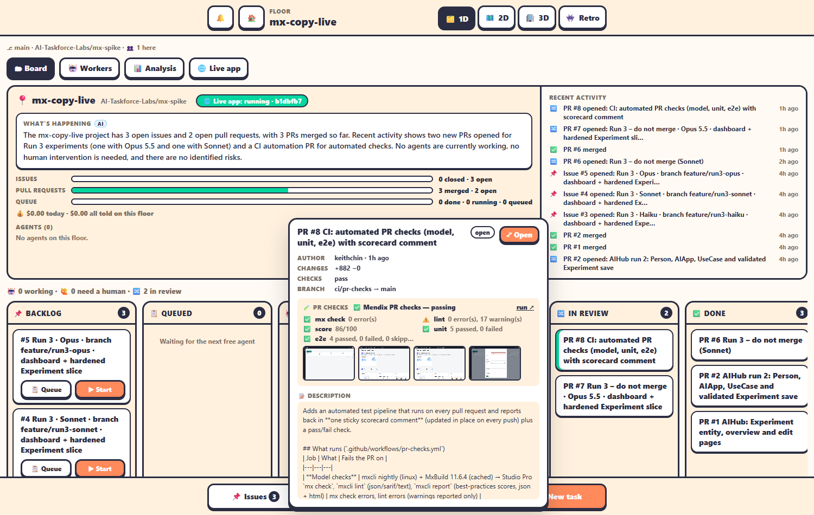

Every pull request in a project runs the **pr-checks** GitHub Actions workflow (`.github/workflows/pr-checks.yml` in the project).

## What it checks

1. Studio Pro's consistency check, **`mx check`**.
2. **`mxcli lint`**.
3. A **best-practice score** (`mxcli report`).
4. **Unit tests** with `mxcli test`.
5. **Playwright UI tests** against the running app.

It posts one sticky **scorecard** comment on the PR, and keeps the screenshots and test results as artifacts. A run takes about 5 Actions minutes.

## In the office

- Hover a PR card on the board for its **checks panel**: the scorecard rows (mx check, lint, score, unit and e2e tests) and a strip of Playwright screenshots. Click one to see it bigger.
- The same panel is in the PR window and on the Testing team's board (**🧪 CI scorecards**).
- A PR with failing checks shows **❌ PR #n has failing checks** in Needs you.

The office downloads the screenshots of the newest run on the PR's branch once, with its own `gh`. The workflow and artifact names can be changed with `AGENT_OFFICE_PR_CHECKS_WORKFLOW` (default `pr-checks.yml`) and `AGENT_OFFICE_PR_SHOTS_ARTIFACTS` (default `screenshots,test-results`).

> [!NOTE]
> The office doesn't write the workflow; each project carries its own, from the mx-spike pipeline. Copy it into a new project's `.github/workflows/`.

## CI emails from the office's own fork

The fork of Agent Office itself (keithchin/mx-office) runs its full test suite on every push to `main`. A GitHub email about a failed run means something broke there. That workflow never publishes releases.
