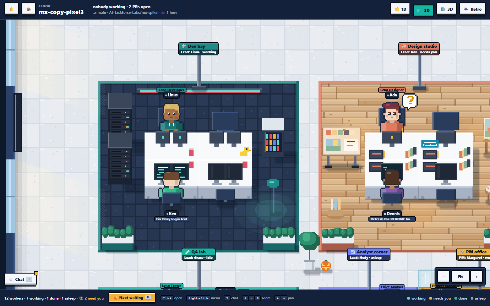

The **2D view** (`/pixel?floor=<id>`) draws the floor from above in pixel art, with every worker at its desk.

Under the top bar is the project's [progress bar](progress-and-acceptance.md), as on the 1D view. Its setup stages open the 1D view's Command Center.

The **📱 Team phone** sits above the zoom buttons at the bottom right: the floor's team chatter, messages to the agents and what needs you, as on the 1D view. See [Team phone](team-phone.md).

## What's on the floor

- **Team zones**: 🛠️ Dev bay, 🎨 Design studio, 🧪 QA lab, 📈 Analyst corner and 🧭 Coordinator office. Each has a signpost with its Lead and status; hover for the Lead's title, name, status and model. Leads are dressed for their role, in their team's color.
- **Jeff's room**: *Router · Jeff* (⚖️), a glass office east of the design studio. Jeff is always seated, in a charcoal suit, glasses and moustache. A switchboard lights up and trays fill for the PM and each team as he routes; a bubble (*→ PM*, *→ Development*) shows each verdict. Click him for today's numbers.
- **Benched Leads on breaks**: a benched Lead takes a break, moving between the lounge TV, a smoke on the balcony and coffee at the kitchen machine. Hover for *🪑 Benched (watching TV…)*; click to open the Org chart and hire them again. Every browser shows the same scene. With reduced motion they stay put.
- **Subagents**: every subagent that has run at least once is a smaller character tagged with its name, *Nia (Hedy's tester)*. While it runs it sits on a stool just behind its Lead's chair, typing on a laptop, with its task under its tag (zoom in, or hover); up to three at once per Lead (the last tag says how many more). Idle, it lives about the office like a benched Lead: the lounge TV, a smoke on the balcony, a coffee in the kitchen, walking between them, and a speech bubble when it's standing by someone else on a break. When a run starts it walks back to its stool along the aisle, and away again when the run ends. A benched one does the same with a *🪑 benched* tag. Hover for who hired it, its model, runs (and how many are unreviewed) and grade; click for its runs and reviews.
- **Things to click**: the 📌 Issues, 📋 Task queue and 🔀 Pull requests boards, the 🛗 elevator (to /home), the 📝 whiteboard, the 🤝 meeting room, 📺 Services and the 📚 bookshelf (the project's docs).

## Mouse

- **Click a worker** to open its terminal.
- **Click a free desk** to start a new task there.
- **Right-click** (or long-press) a worker for its menu: ⌨️ Terminal, 📝 Changes, ✍️ Prompt, 🏠 Send home.
- Hover anything for a card.

## Keys

| Key | Does |
|---|---|
| **N** | Next worker that needs you: pans there and opens its terminal. |
| **T** | Chat. |
| **+** / **=** / **−** / **0** | Zoom in, out, fit. |
| Arrows | Pan. |
| Esc | Close the menu. |

Drag to pan, Ctrl+wheel or pinch to zoom. The footer shows worker counts, **🙋 Next waiting**, the keys and a legend.

The 2D view follows the **🎨** theme: Default as drawn, Dark as a blue dusk with warm lamp pools, Terminal in green phosphor, Clean (Light) almost untinted, Clean (Dark) a neutral grey night.
