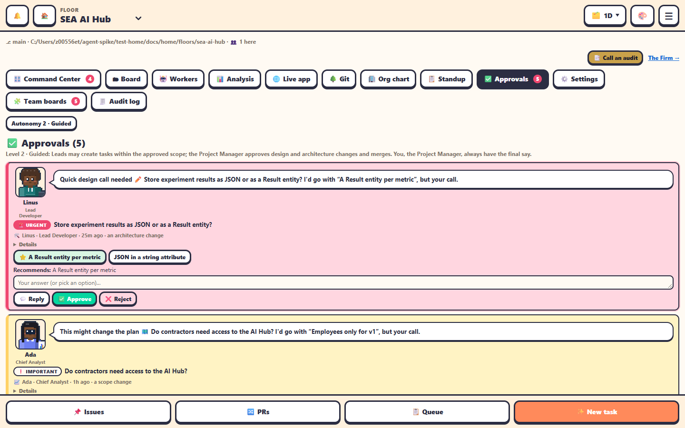

The **✅ Approvals** tab collects everything waiting for the Project Manager on this floor. The badge on the tab is its count.

## What appears here

| Item | Comes from | You can |
|---|---|---|
| 🚩 **Escalations** | An agent's `office-workers escalate`, a handoff note's `AWAITING-PM:` line, Jeff (when On), or an *ask* gate | Reply, Approve, Reject |
| 📝 **Proposals** | The standup | Approve, Reject, Change |
| 🧰 **Subagent actions** | A Lead's warn, bench or swap-model whose gate is *propose* | Approve, Reject |
| 🔀 **Merges** | Team pull requests ready to merge, when your level asks you to approve merges (levels 1 to 3) | Review on GitHub |
| 💸 **Daily cost cap reached** | The floor's cap for its level is spent | Raise it in Settings |

Open escalations are in Jeff's order when his **Priority** is on, with the **🧑‍⚖️ #1 · resolve first** chip beside the top one. See [Jeff · Router](../automation/jeff-router.md#priority-which-escalation-first).

The top of the tab says which autonomy level is set, and: *You, the Project Manager, always have the final say.* When there's nothing: *Nothing needs you right now.*

See [Autonomy levels](../teams-and-agents/autonomy.md) and [Escalations](../teams-and-agents/escalations.md).
