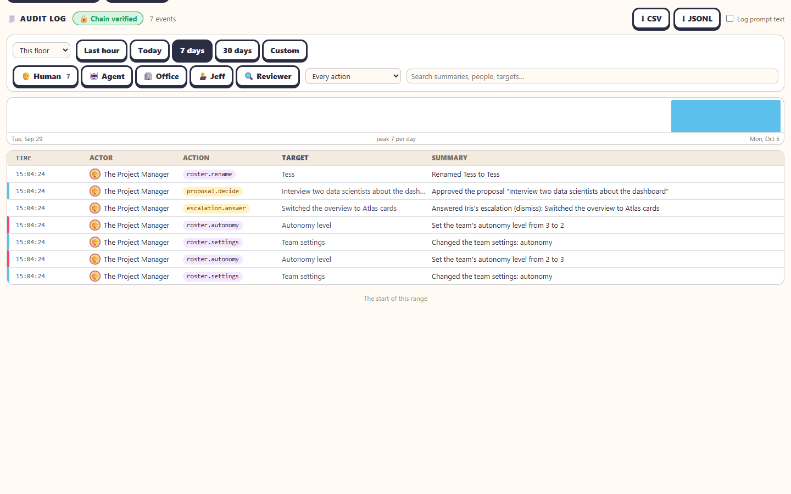

The **🧾 Audit log** records who did what, and when: people, agents, the office itself, Jeff and The Firm's reviewers. It is **append-only** and **hash-chained**, so an edited or removed line shows. Its second sub-tab, **🚨 Incidents**, keeps what went wrong or nearly did, with cause and follow-up: see [Incidents](incidents.md).

## Where to find it

Above the log is The Firm's strip: **📑 Call an audit** and **The Firm →**, or the audit running, or its report ready (in a Portal theme these are the page header's buttons). See [The Firm](the-firm.md).

- On a project's 1D view: the **🧾 Audit log** tab (`?tab=audit`). It opens on **This floor**.
- On [/home](home.md): the **🧾 Audit log** tab, across **Every floor**, with a floor column.

## Reading it

- The header shows **🔒 Chain verified** when every line points at the one before it, or **⚠️ Chain broken at** *time (floor)* when a line was edited, removed or moved since it was written. Next to it, the number of events.
- Each row: **Time**, **Actor** (with an icon for Human, Agent, Office, Jeff or Reviewer), **Action** (a dotted verb such as `worker.hire`, `escalation.answer`, `roster.autonomy`, `settings.change`), **Target** and **Summary**. The colour bar on the left is the severity (info, notice, warning).
- Click a row to expand its **details**. Settings changes show **before** and **after**.
- New events appear as a **↑ N new events** pill instead of moving the table under you. Scroll down to load older ones, until *The start of this range*.

## Filters

| Filter | Choices |
|---|---|
| Scope | **This floor**, **Office-wide** (logins, settings, floors added and removed), **Every floor**; on /home, each floor by name |
| Time | **Last hour**, **Today**, **7 days**, **30 days**, **Custom** (From … to …) |
| Who | **Human**, **Agent**, **Office**, **Jeff**, **Reviewer**, each with a count |
| Kind of action | Every action, Team, Agents, Escalations & approvals, GitHub, Settings, Access, Jeff, The Firm |
| Search | Summaries, people and targets |

The **histogram** above the table shows events over time. Click a bar to zoom into it.

## For admins

- **⬇ CSV** and **⬇ JSONL** download every event that matches the filters. The export itself is logged (`audit.export`).
- **Log prompt text**: keep the first 80 characters of every prompt a person sends a worker. Off (the default), only its length is logged. Turning it on or off is logged too.
- Under an expanded row: **🚨 Create incident from this event**, or **Link to incident…** to add it to one that's still open. See [Incidents](incidents.md).

> [!IMPORTANT]
> The audit log never records token values. Prompt text is off unless an admin turns it on.

## Where it's kept

`<office data>/audit/<floor>.jsonl`, one file per floor, and `audit/_office.jsonl` for the office's own events. Each line carries `prev` (the sha256 of the line before) and `hash`. Past a size cap the oldest lines move to `audit/archive/<floor>-<month>.jsonl`. See [Data locations](../administration/data-locations.md).

## Related

- [The Firm](the-firm.md), which reads the log as evidence and records its own steps
- [Security and tokens](../administration/security-and-tokens.md) · API: `GET /api/audit`, `GET /api/audit/export`, `POST /api/audit/settings` ([API endpoints](../reference/api-endpoints.md))
