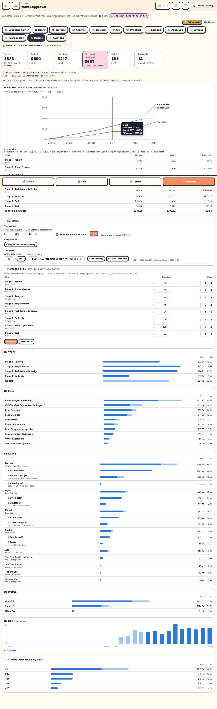

The **💰 Budget** tab shows what a project has spent in US dollars, and in a local currency too. The office is billed per API call, so these are real dollars.

## The top bar

Two chips sit in the top bar of the 1D and 2D views:

- **Next to the floor's branch**: the project's spend, as `$42 today · $252 / $600 · 42 %`. With no budget set it reads `$42 today · $252 spent`. Hover for the same numbers in the local currency, and the rate's date.
- **At the far right**: the whole office, as `Office $110 today`. This covers every project plus the office's own calls. If the office has a daily budget (`--budget`), it shows that too: `Office $110 / $150 today`.

The project chip is **green** inside the budget, **amber** within 10 % of it and **red** over it. It goes by the forecast at completion when there is one, and by spend so far when there isn't. Click either chip to open the Budget tab. The 2D view's chips open the 1D view's tab. In the Clean themes the chips use line icons, not emoji.

## The headline

**Spent**, **Budget**, **Remaining**, **Forecast at completion**, **Today** and **Days active**, each with the local-currency amount underneath. Under the tiles you'll see:

- calls that are **not metered**: providers the office can't price, like Codex or OpenCode. They're counted but not costed.
- the exchange rate in use.

## Where the money went

Each table has a bar per row, the amount and its share of the whole:

- **By stage**: the toolkit stage that was active when the money was spent (P to 7). The stage is read the way the setup panel reads it: from the project's default branch on origin (the floor's folder when there's no remote), checked again at most once a minute. Spend outside a pipeline, or from before the office kept a ledger, shows as *No stage*.
- **By role**: the team's roles. Each Lead's subagents get a row of their own, and the office's background calls are under *Office background*.
- **By agent**: every worker. A Lead's subagents are nested under it (*Business Analyst · hired by Barbara*). The Lead's own row covers both its own session and its subagents.
- **By model**: Opus, Sonnet, Haiku and so on.
- **By day**: columns for the last 30 days. Hover a column for its amount, or open **Table view** to see every value.
- **Top issues and pull requests**: spend is credited to the issue the worker was on. That's the issue on its queue task, or the one named in its prompt. If there's no issue, it goes to the worker's pull request.

### Estimated history

When the office starts a project's ledger, it fills in what had already been spent. That comes from two places: the workers at their desks (their session's usage so far) and the analysis runs log (`analysis/runs.jsonl`, which also covers workers who have gone home). Each worker's total is spread evenly over the days it was around. These amounts show as the **lighter part of each bar**, labelled *Estimated from history*, because the real days aren't known. Anything spent after that is booked as it happens.

## How spend is counted

- **Workers**: each worker's tokens come from its Claude Code transcript, subagents included, priced from the office's price list. The office's Ledger (the office total) and the project ledger book the same change, at the same moment, so the two never disagree. The project ledger also splits each change by agent (the worker, or a subagent type) and by model.
- **The office's background calls** are booked on the floor they served, and added to the office total. These are Jeff's Haiku fallback, the analyzer, task naming, the project summary and the Firm's reviewers. A call that served no floor (the office's own) goes on the office view. Jeff's calls to Jev aren't priced, so they show as not metered. Gate-check makes no model calls.
- **Providers other than Claude** count their calls but no cost.

## Insights

**Insights** covers the last 30 days. It has two parts.

**What drives the spend:**

- a model family the Leads run on that takes 40 % or more of spend (*Opus Leads are 71 % of spend*).
- the Lead Tester's review loop (its own session plus its subagents) when it's 15 % or more of the week.
- the Coordinator's relays, when there are 20 or more turns a day.
- the office's own calls, when they're 5 % or more of spend.

**Ways to spend less.** Each suggestion has a button to the action that already exists:

- **Move a Lead from Opus to Sonnet** when its Opus work is a fifth or more of the week. The saving is half of that, from the price list. Goes to the Org chart.
- **Delegate to its subagents** when a Lead does 80 % or more of its work itself on Opus. Goes to the Org chart.
- **Turn on idle benching**, when it's off. Goes to the team settings.
- **Switch on Jeff's real-ask mode** (Jeff's *waiting* judgement on), when it's off or in shadow. Goes to the team settings.
- **Turn off early drafts**, while the pipeline is before Stage 3 and Design, Development and Testing have spent 10 % or more on drafts. Goes to the team settings.

The model suggestions show the Lead's **token-efficiency score** from the [worker ranking](workers.md) where it has one.

## The expected plan

Every project gets an expected plan, made automatically. It gives an expected cost per toolkit stage (and per build module once there is a build plan) and an expected end date. Expand **Expected plan** on the tab to see it. Admins can change any line's cost or working days; each edited line records who changed it.

The plan is built from:

- **Size tier and entry mode**, from `agent-office.project.json` or the decision register in `PROJECT.md`. If neither says, the plan assumes a standard requirements-driven project.
- **The stages that mode runs**:
  - Greenfield: P (light), 0 (scope only), 5 and 6.
  - Requirements-driven: P and 0 to 6.
  - Changing an existing app: P and 0 to 6, with stages 1 to 4 at 60 %.
  - Migration: everything up to 7, with analysis at 130 %.
  - Assurance only: one line.
- **Build modules**: the folders in `architecture/modules/`, or the module headings in `architecture/build-plan.md`. Until there's a build plan, a small project assumes one module and a standard project four. While nobody has edited the plan, it follows the build plan's modules as they appear.
- **This office's history**: once the analysis runs log has at least 5 runs of the right task types, a line is priced from their median cost. Build uses *domain-model*, *logic*, *ui-pages* and *security* runs (4 runs a module). Test uses *tests* and *bugfix* runs (4 a stage). Stages 1 and 2 use *docs* runs (6 and 5).
- **Otherwise, the default rates** below. They're for a standard project at Balanced. A small project costs half as much for every stage except build.

| Stage | Default cost | Working days |
|---|---|---|
| P · Kickoff | $15 | 1 |
| 0 · Triage & scope | $30 | 1 |
| 1 · Analysis | $90 | 3 |
| 2 · Requirements | $80 | 3 |
| 3 · Architecture & design | $90 | 3 |
| 4 · Build plan | $40 | 1 |
| 5 · Build | $120 per module | 2 per module |
| 6 · Test | $80 | 2 |
| 7 · Cutover | $40 | 1 |

Each line's cost is spread evenly over its working days, Monday to Friday, which gives the expected cumulative curve. **Make again** rebuilds the plan from the project, and edited lines are replaced too. If a [Firm audit](the-firm.md) of the project gave a cost re-forecast or milestone dates, **Apply the Firm's re-forecast** scales the plan's lines to its total and takes its last milestone as the end date.

## Plan against actual, and the forecast

**Plan against actual** shows the expected cumulative spend (orange) against the actual (blue). The budget is drawn as a line, and the forecast at completion as the end point. Hover anywhere on the chart for that day's plan, actual and difference, or open **Table view** for every value. Below the chart, a table shows each stage's planned and actual cost and the difference. A stage counts as **done** once the project has moved past it.

The **forecast at completion** works like this:

> forecast = actual + remaining plan × (actual ÷ planned, for the completed stages)

- **Remaining plan** is what's left of the current stage plus every stage ahead.
- **The factor** (actual ÷ planned) is kept between 0.5 and 2, so one odd stage can't swing the forecast. With no stage finished yet, it's 1.
- **The forecast** never drops below what has already been spent.

The forecast appears in the headline and sets the colour of the top bar's chip.

## Alerts

The budget raises an alert:

- at the **alert threshold** (80 % unless the project or the office sets another).
- at **100 %**.
- when the **forecast** goes over the budget.

Each alert is raised once per budget. Raising the budget clears all of them, so crossing a level of the new budget is news again. Each alert:

- goes to the [audit log](audit-log.md) (`budget.alert`) and appears as a toast.
- shows on **🚨 Needs you** on the Command Center (kind `budget`), which also feeds the [Teams cards](../integrations/teams-notifications.md) and the Team phone.
- at 100 %, also sends a desktop notification.

## Auto-pause at 100 %

When spend reaches the budget and **Pause the project at 100 %** is on (the default), the office pauses the project with [⏸ Pause project](resume-and-pause.md), recorded as the budget's doing:

- agents finish the turn they're on, write a handoff note and go to sleep.
- nobody new is hired, and the office sends no prompts of its own (nudges, standups, relays, wakes).
- **people's messages still go through**.
- the floor's pause line reads *⏸ Paused: budget reached*, and the pause survives a restart.

Needs you then says *Budget reached: project paused*, with **Raise budget** and **Resume** buttons. **Resume** opens the ▶ Resume project preview (who has work waiting, and what's safe). Raising the budget above what's spent resumes the project the default way (*Those with work*). Either way the project won't pause again for the same budget. If a person resumes it from ▶ Resume project instead, the budget sees that too.

## Settings

On the tab (admins; every change is in the audit log):

- **This project**: the total budget (USD), the alert threshold and auto-pause.
- **Budget level**: **Change level** shows the [new-project wizard's](../get-started/first-project.md#page-5-budget) cards again, priced for this project. Applying a level sets the budget and the team's models and settings.
- **The office**: the default alert threshold, and the local currency.

### Budget levels

A level sets the Leads' model, their subagents' models (Haiku only where the role allows it), early drafts and autonomy by stage, and how many subagents a Lead runs at once: the Leads' Playbooks say "Run at most N subagents at once" (Lean 1, Balanced 2, Fast 4). The changes apply from each Lead's next hire or Playbook rewrite. A running session keeps the model it started on, and a Lead only hears about a subagent change between turns, so nobody is interrupted mid-turn.

## Currency

Dollars are always shown. Admins pick a second, local currency (**SGD** by default) and where its rate comes from:

- **Daily** (the default): fetched once a day from the European Central Bank's reference rates, through [frankfurter](https://frankfurter.dev). It's free and needs no key. Each amount says which day the rate is from. If a fetch fails, the last good rate stays in use and the page says the fetch failed.
- **By hand**: type the rate (how much of the local currency one US dollar buys).

## Where it's kept

Each project's ledger is in the office's data folder, at `budget/<floor>.json`. It holds:

- a rollup for every day, kept forever: the total, plus splits by stage, role, model, agent and issue/PR.
- detailed rows (day × agent × model × stage × issue) for the last 30 days.
- the toolkit stage each time it changed.

The office's own settings and its unattributed background calls are in `budget/office.json`. See the [settings reference](../reference/settings-reference.md#office-settings-budget).
