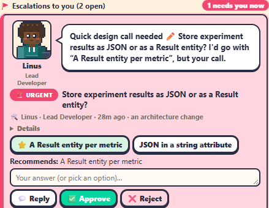

The **🎛️ Command Center** is the first tab of every project and the place to keep open. From top to bottom: **The Firm** strip, **Needs you**, the **Project setup** panel (toolkit projects being set up), and the **project summary** with the **Project Coordinator console** in its middle and **Team chatter** beside it.

## 📑 The Firm strip

A slim strip at the top: **📑 Call an audit** and **The Firm →** when no audit is running (calling one is for admins); *The Firm is auditing this project: N reviewers · $spent of $cap · phase* with **View →** while one runs (amber at 80 % of the budget); **📑 Audit report ready from The Firm → Read** when it's delivered. See [The Firm](the-firm.md).

## 🚨 Needs you

Everything waiting for a human on this floor, most urgent first; escalations in Jeff's order when his [priority sort](../automation/jeff-router.md#priority-which-escalation-first) is on. It folds after five items (**Show N more ▾**). When it's empty it says *✅ Nothing needs you right now.*

| Icon | Item | Button |
|---|---|---|
| 🙋 | *&lt;name&gt; is asking: …* (a question or a permission prompt) | **Answer**: opens its terminal |
| ✅ | *&lt;name&gt; finished: &lt;summary&gt;, not looked at yet* (not for a [quiet turn](../concepts/workers-and-worktrees.md#quiet-turns): one the office started, or a team member's at autonomy 3 and up) | **Review**: opens its terminal |
| 🚩 | An escalation, tagged CRITICAL, URGENT, IMPORTANT or INFO | **Answer** (admin) or **View**: jumps to the card |
| 🔀 💸 🧰 📝 | An approval: a merge, a cost cap, a subagent action, a proposal | **Review**: opens Approvals |
| 💸 | *Spend cap reached: office prompts paused; agents finish their current turn* (the daily cap is spent) | **Settings** |
| ❌ | *PR #n has failing checks* | **Open PR #n** |
| ✋ | *Stage X waits for your sign-off* | **Sign off**: scrolls to the setup panel |
| 🌐 | *The live app failed* | **Live app** |
| 🌿 | A worktree was deleted outside the office | **Fix** |
| 🙋 | *N waiting on &lt;other floor&gt;* | **Go** |
| 📑 | *Audit report ready from The Firm* (and The Firm's budget warnings) | **Read** |

**Finished, not looked at yet.** An agent that ended its turn and that nobody has opened since counts as waiting on you. Its worker card says *👀 Finished, not looked at yet: … open it to see*. Opening its terminal clears it.

**Answer → lands on the escalation in one step.** The list scrolls to the card, the card pulses, and its reply box gets the focus.

## 🧰 Project setup

Shown for toolkit projects until the build plan is confirmed.

- Chips for the entry mode (🧭) and the size tier (📏).
- Buttons **🧭 Entry mode**, **📝 Intake** and **👥 Team** reopen the wizard at that page. **🔄 Re-check gates** (admins only) runs the toolkit's `gate-check.sh` over this floor's checkout, about a minute, so the verdicts are fresh. It rewrites the gate dashboard (`index.html`) and the *Current stage* line in `PROJECT.md`, left uncommitted for the next commit. It doesn't change answers or decisions, start agents or push anything. **ℹ️ What does Re-check gates do?** under the panel says the same.
- The stages **P** Kickoff, **0** Triage & scope, **1** Analysis, **2** Requirements, **3** Architecture & design, **4** Build plan, each ✅ PASS, ⏳ PENDING, ⚠️ FAIL, ↷ WAIVED or ✋ MANUAL.
- *Next: …* and **❓ N open questions**.

See [The toolkit](../integrations/toolkit.md).

## The project summary

- **📍 Name**, the repo, a **🌐 Live app** chip (it opens the Live app tab) and, for a Mendix project, **Open in Studio Pro** (see below).
- The goal, and **🧭 phase** with stage dots and how many decisions are recorded.
- **What's happening**: a short story of the floor, written by Claude Haiku (*AI*) or put together by the office (*auto*).
- **Risks**: agents waiting on a human (and for how long), blocked or failing things.
- Progress bars for **issues**, **pull requests** and the **queue**, and **💰 $x today · $y all told on this floor**.
- **Agents (N)**, and **Recent activity** and **💬 Team chatter** on the right.

## Open in Studio Pro

For a floor with a Mendix project, **Open in Studio Pro** in the summary's heading (and ☰ → 🧱 **Open in Studio Pro**, on every view) opens the floor's `.mpr` in Studio Pro **on the office's computer**. It's the project in the floor's own checkout (at its top or one folder down), not the live app's clone.

- **Admins only.** Everyone else sees it greyed out. It's hidden on a floor without a `.mpr`.
- **A confirm first.** Studio Pro locks the project while it's open, and the agents write it with `mxcli exec` (one writer per app: the Lead Developer). The confirm says the office pauses their mxcli writes automatically while Studio Pro is open (see [Studio mode](#studio-mode)), and lists the agents on the floor in the middle of a turn. Let them finish their turn before you change anything in Studio Pro.
- It goes through Mendix's **Version Selector**, which starts the Studio Pro version the project was saved in (*Opening in Studio Pro 11.6.4…*). Without the Version Selector, the `studiopro.exe` of that version under `C:\Program Files\Mendix` (never another version: it would offer to convert the project).
- Opening it is written in the [Audit log](audit-log.md) (`studio.open`, under *Workers*), said in Team chatter, and toasted to everyone on the floor.
- It can't open when the office isn't on Windows, runs without a desktop (over SSH, in CI, headless), or Studio Pro isn't installed: the button is greyed out and says why.

### Studio mode

The office looks for itself whether Studio Pro has the floor's project open, however it was opened (the button, the Version Selector, Studio Pro's own start page), every 4 seconds, for floors with a `.mpr` only. While it's open, the floor is in **Studio mode**:

- Beside the button, a chip says **Studio Pro open · mxcli paused** (with **· MCP** when Studio Pro's MCP server answers), and the button turns into a greyed-out **Studio Pro is open**. Hover either for since when, and the process.
- **The agents' model writes are held.** Every Claude worker on the floor has a PreToolUse hook for Bash (`bin/studio-guard.js`) that denies `mxcli exec`, `fix`, `layout`, `rename`, `widget sync`, `theme switcher install`, an `mxcli -c` with a statement that writes, the mxcli REPL, the toolkit's `bin/exec.sh` and `bin/restore-mpr.sh`, its `wf-*.py` patches and `mx update-widgets`/`convert`, from the floor's checkout or any worktree. The agent is told why (*Studio Pro has &lt;app&gt; open… Don't write to the model with mxcli*) and to work on reviews, tests or docs, or escalate, meanwhile. Reads (`mxcli check`, `lint`, `report`, `show`, `describe`, `diff`, `--dry-run`) and `bin/verify-model.sh` still run. Each held write is in the Audit log (`studio.denied`, under the agent's name).
- **Through Studio Pro instead.** On Mendix 11.10 and up, Studio Pro serves MCP at `http://localhost:7782/mcp` (`AGENT_OFFICE_STUDIO_MCP_PORT` or `AGENT_OFFICE_STUDIO_MCP_URL` to change it). When it answers, the agents are told to route their writes through it with `mxcli --mcp http://localhost:7782/mcp …`, which the hook lets through: Studio Pro makes the change itself.
- It's said once in Team chatter (*Studio Pro is open on &lt;app&gt; — mxcli writes paused*, and *Studio Pro closed — mxcli writes allowed again*), toasted, and written in the Audit log (`studio.opened`, `studio.closed`).
- **When Studio Pro closes**, writes are allowed again. If the checkout then has model changes nobody committed (the `.mpr` or `mprcontents/`), **Needs you** says *Commit your Studio Pro changes so the agents build on them* until they're committed.
- **Stale lock.** Studio Pro writes `<app>.mpr.lock` (with its process id) and leaves it behind when it closes. A lock whose Studio Pro isn't running is written in the Audit log (`studio.stale-lock`) and mentioned in the open confirm, but gets no chip on the Command Center (most Mendix floors have one) and writes aren't paused for it.

How it knows: a `studiopro.exe` whose command line names the `.mpr` (or its folder), or the lock's process id being a running `studiopro.exe`. Windows only: elsewhere there's no Studio Pro to see. What changed is kept in the floor's `.agent-office/studio-mode.json`, so a restart picks up where it was (a Studio Pro that closed while the office was down is a `studio.closed` on the first look). While Studio mode is on, the office keeps `.agent-office/studio-open.json` in the floor's checkout: that's what the hook reads. Workers started before this version get the hook when they're next started or resumed, and agents other than Claude Code aren't held.

## 💬 Team chatter

Beside Recent activity: what the agents say to each other, as a chat thread, newest on top. Each message shows the speaker's portrait, who it was said to (recipient chips) and a speech bubble; click it to open what it's about (the worker, the escalation, the pull request, the standup or the journal entry).

What shows up: escalations and your answers, the office's and Jeff's relays to the Project Coordinator, standups and proposal decisions, review nudges, subagent tasks and the Leads' verdicts, handoff notes and rehires, agents telling or hiring each other, PRs handed over, team journal entries (a line naming a teammate counts as said to them), and The Firm's interview questions and answers. Nothing is made up: only what was really said or written, with tokens redacted and long text clipped.

- Filters: **All**, **Between agents**, **With me** (you, the Project Manager), or **Only one person**.
- New messages slide in on top without moving your scroll; scrolled down, an **N new** pill takes you back up. **Load older** pages back.
- Each team's page on [Team boards](team-boards.md) has a short version with that team's messages.

Kept in `<office data>/chatter/<floor>.jsonl`, the newest 1000 per floor.

## The Project Coordinator console

In the middle of the summary:

- The Coordinator's name, model, cost and state: *Not hired*, *Starting*, *Working*, *Needs you*, *Idle*, *Asleep*, *Writing handoff* or *Benched*. **⏰ Wake** and **⤢ Open** (its full terminal).
- Its **live terminal**, read-only. Watching it keeps the Coordinator from being benched for idling.
- **Ask the Project Coordinator…**: Enter sends, Shift+Enter adds a line, ↑/↓ recall what you sent. It confirms *Sent ✓*, or *Queued while busy ⏳* when the Coordinator is mid-turn.
- Quick chips: **📊 Status update**, **🚧 What's blocking?**, **🗺️ Plan next steps**, **📋 Run standup**.
- No Coordinator yet? **🤝 Hire Project Coordinator** (admin). Benched? Its latest handoff note and **🤝 Hire again**.

## 🚩 Escalations to you

Above the ask box: **Escalations to you (N open)**, with *N need you now* when any are urgent or critical.

When Jeff's **Priority** is on (the default) and he has rated them, the open cards are in his order under *Sorted by Jeff · Router — resolve from the top*, each with a chip beside it: **🧑‍⚖️ #1 · resolve first**, **#2**, **#3**… (hover for why). A critical or urgent one he hasn't rated yet stays on top. See [Jeff · Router](../automation/jeff-router.md#priority-which-escalation-first).

Each card shows:

- **who raised it**: the agent's 2D character, big, with its name and role title, and what it needs in a speech bubble beside it;
- the urgency tag (or FYI), the title, the trigger and how long ago;
- **Details** (expandable), the **options** (⭐ marks the recommended one; clicking one fills in *Go with: …*) and **Recommends: …**.

As admin you answer with a reply box and **💬 Reply**, **✅ Approve** or **❌ Reject** (reply and reject need text). An FYI gets **✓ Noted**. Answered cards fold into **Answered (N)**.

See [Escalations](../teams-and-agents/escalations.md).
