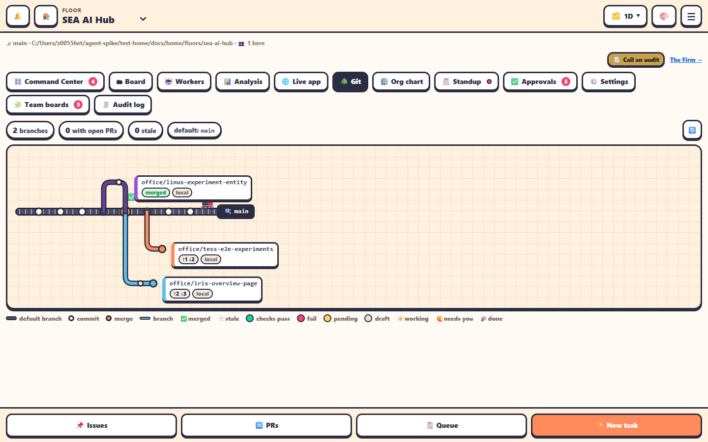

The **🌳 Git** tab draws the repository as a **metro map**, so you can see at a glance who is working on what and how far each branch is from `main`.

## Reading the map

- The **default branch** (`main`) is the trunk, with a 🚉 sign and a station per commit.
- Each **open branch** drops below the trunk from where it forked.
- **Merged branches** loop above and rejoin the trunk at the merge (✅). Squash-merged ones are dashed and end in ✅.
- The **worker's pixel robot** stands at each branch tip, with its **PR pill**: passing, failing, pending or draft.

Branch labels show **↑ahead ↓behind**, 🕸️ for a stale branch (more than 20 commits behind), **#PR**, the worker's name, and *local* for a branch not pushed yet.

The strip on top: *N branches · N with open PRs · N stale · default: main*, and **🔄** to refresh.

## Using it

- Hover a branch or a commit for its details.
- Click a branch to open its worker's terminal, or its pull request.
- It refreshes every 60 seconds while you look at it.

> [!TIP]
> A long, stale line with no PR is often a worker that got stuck. Click it to open its terminal.
