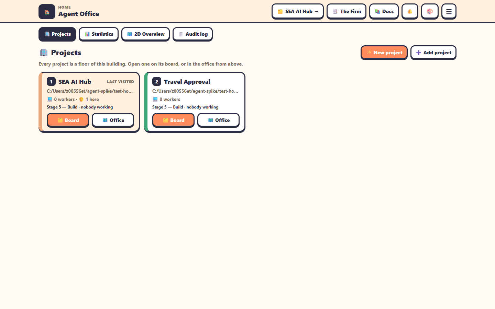
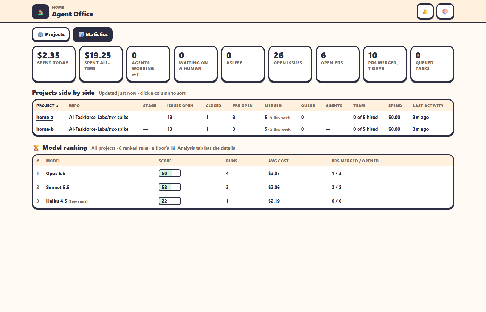
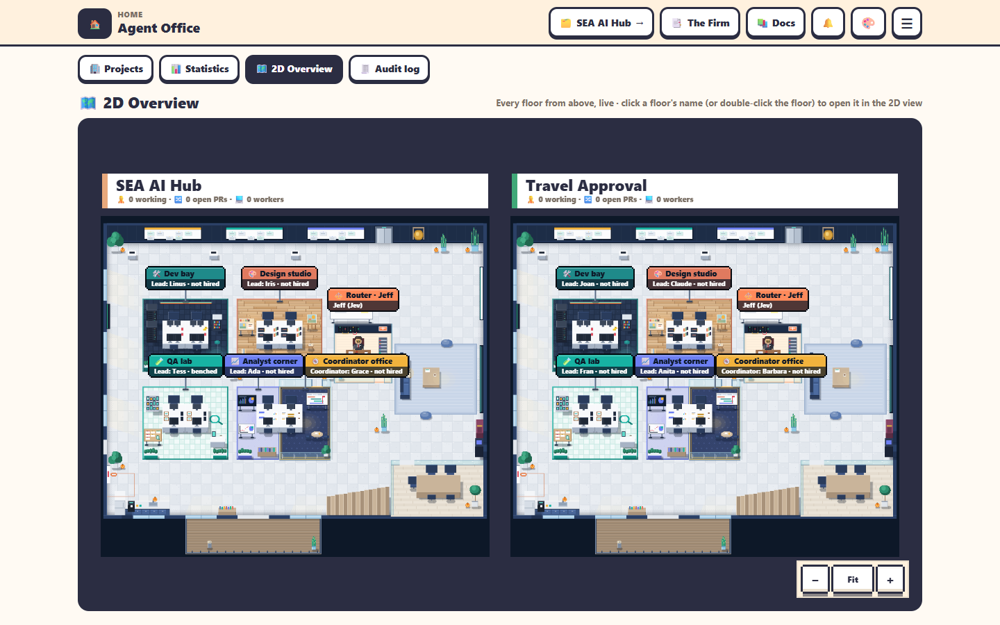

`/home` is where the office opens. It has four tabs. The last one you used is remembered, and a link can open one with `?tab=projects`, `?tab=stats`, `?tab=overview` or `?tab=audit`.

The top bar has **🏠**, a **back link** to the floor you were last on (in the view you last used), **📑 The Firm** (opens [/firm](the-firm.md)), **📚 Docs**, **🎨** and **☰**.

**Loading.** Home, the 1D and 2D views and the phone version open on **Mx Office**'s loading screen, drawn by the page itself so it's there at once: *Loading Mx Office… 60 %*, moving on as the page's code loads, your sign-in is checked, the connection comes up, the office's data arrives and the first view is drawn, then it fades. In the page's color theme, without emoji in the Clean themes, and without animation when your system asks for reduced motion. If the office is down or restarting (🔁 Restart safely, an update), it says *Mx Office is restarting… reconnecting*, keeps trying, and carries on once the office answers; a connection lost for more than 2 seconds later brings it back the same way.

## 🏢 Projects

**In the Portal themes** (the default) this tab is a **Projects** page, like a low-code platform's portal:

- the page's title, **Projects**, with **Add project** and **New project** (the wizard) at its right, over Home's tabs (Projects, Statistics, 2D Overview, Audit log, Budget) drawn as underline tabs;
- a filter row: **Search by project name** (the name or the repository), a status select (*All statuses*, *Needs you*, *Running*, *Paused*, *Being added*), the sort (*Pinned*, *Recent activity*, *Name*) with a button that turns the order round, and **Pause all projects** / **Resume all** and **Connections** (admins). The status and the sort are remembered in this browser;
- a card per project: a tile with its letters in the floor's colour, its name (opens its board), `repo · ⎇ branch`, the one-line summary, the small progress bar, and at the bottom its status (*Running*, *Needs you*, *Paused*, *Being added*) and what it has spent against its budget;
- at each card's top right: **👁 watch** (on by default; a project you stop watching no longer calls you over from another floor's pages or counts in the tab title), **pin** (pinned projects come first under *Pinned*), and **⋯**: *Open project*, *View live app*, *Edit in Studio Pro* (asks to open it from the project's page, admins) and, for admins, *Pause project* or *Resume project*.

Pins and watches are kept per viewer, in this browser. The cards follow the office live; on a phone they're one a row.

In the other themes the tab is as below.

One card per floor:

- its number, name and a *last visited* tag;
- `repo · ⎇ branch`, or a progress bar while it clones;
- **🙋 N waiting · 👷 N working · 💻 N workers · 🧑 N here**;
- the one-line project summary (for example *Stage 3 · 2 agents working · 🙋 1 needs you*);
- a small [progress bar](progress-and-acceptance.md): the project's phases as coloured segments, and where it is (*Stage 3 · Architecture & Design*) or which version was accepted (*v1 accepted · 2026-10-08*);
- **🗂️ Open project**: its 1D view, on the Command Center (the 2D Office view is the project's **Go to Office**).

By the name, an icon says whether the project is [paused or running](resume-and-pause.md). Hover it for more:

| Icon | State | Tooltip |
| --- | --- | --- |
| ⏸ | Paused | Who paused it and when, and why: *Paused by Keith at 14:05*, *… for a safe restart*, or *Paused at 14:05: budget reached*. |
| ▶ | Running | *Running: 2 agents working, 3 asleep* (and anyone waiting on you). |
| ⏳ (amber) | Pausing or resuming | How far the run is: *Pausing: 2 of 4 agents*. |

The Clean and Portal themes draw them as line icons. The 2D Overview's banners show the same state at their right, and inside a project the same state is the one control beside its budget chip (see [Command Center](command-center.md)).

Opening a project shows *Loading project mx-spike… 0 %* over this page at once; the project's page then shows **Mx Office**'s loading screen and the project's own loading overlay, with real progress.

Above the cards:

- **✨ New project** opens the wizard. See [Create your first project](../get-started/first-project.md).
- **➕ Add project** adds an existing repository.
- **⏸ Pause all projects** or **▶ Resume all projects** (admins), one button that follows the projects: *Pause all* while any project is running, *Resume all* once every one is paused. With a mix there's a **▶ Resume N paused** link beside it that resumes only the paused ones. While a pause or resume is going, the button shows its progress (*⏸ Pausing… 3 of 7*) and can't be clicked. Everyone else sees the state in words (*⏸ 2 of 4 projects paused*). It and the icons keep up by themselves (every 15 seconds, every 2 while a run is going).

## 📊 Statistics

- **Tiles**: spent today, spent all-time, agents working, waiting on a human, asleep, open issues, open PRs, PRs merged in 7 days, queued tasks.
- **Projects side by side**: a sortable table with stage, issues open and closed, PRs open and merged, queue, agents, team, spend and last activity.
- **🏆 Model ranking**: the top 8 models across all projects by score, with runs, average cost and PRs merged and opened. See [Analysis](model-analysis.md).

## 🗺️ 2D Overview

Every floor drawn in pixel art on one canvas, each under a banner with its name and numbers. It refreshes every 10 seconds.

- Hover a worker, or a benched Lead on a break, for details. A Lead's subagents are there as in the 2D view: on stools beside its desk while they work, about the office otherwise.
- Click a banner (or double-click a floor) to open the project (its 1D view).
- Zoom with the wheel or pinch, drag to pan, **+ − 0** and the arrows work too.

## 🧾 Audit log

The office's [audit log](audit-log.md) across **Every floor**, with a floor column and a floor picker (or **Office-wide** for sign-ins, settings and floors added and removed). Same filters, histogram, chain badge and, for admins, CSV / JSONL export as a project's tab.

## 💰 Budget

Every project's spend in one place. For each project you get:

- a status chip: *Within budget*, *Close to budget*, *Over budget* or *Paused*.
- what it has spent against its budget, as a meter.
- its forecast at completion and today's spend.
- a 14-day sparkline; hover it for the numbers.

Click a project's name to open its [Budget tab](budget.md). Under the table:

- **the office's own calls**, by source: Jeff, the analyzer, task naming, the project summary and the Firm.
- **the Firm's audits**, with what each spent against its budget.

The tiles across the top give today's spend for the whole office, the all-time total, the background-call overhead and the audits.
