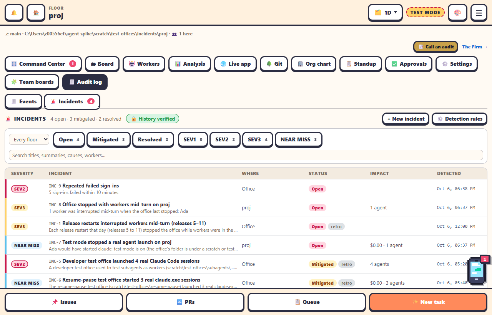

An **incident** is something that went wrong, or nearly did, and is worth a record of its own: what happened, how bad it was, why, and what's being done about it. Routine events stay in the [Audit log](audit-log.md); an incident links to the events it's about.

## Where to find it

The **🚨 Incidents** sub-tab inside the **🧾 Audit log** tab, on a project's 1D view (it opens on **This floor**) and on [/home](home.md) (every floor). The red count on the sub-tab is the open incidents. Open **sev1** and **sev2** incidents also appear in **Needs you** on the [Command Center](command-center.md), on the [📱 Team phone](team-phone.md) and in the [Teams notifications](../integrations/teams-notifications.md). A new **sev1** also alerts on the Team phone (a desktop notification and its sound), like its other red items: Do not disturb holds it, and it skips the digest because it's red.

## Reading it

| Field | Meaning |
|---|---|
| Severity | **Sev 1** critical, **Sev 2** major, **Sev 3** minor, or **Near miss** (it nearly went wrong) |
| Status | **Open**, **Mitigated** (the harm is stopped, follow-up still open), **Resolved** (with a root cause) |
| Detected | When, and by whom: an automatic rule, an agent or a person |
| Where | The floors it's on, or the office as a whole |
| Impact | Spend in dollars, agents affected, data touched, anything else |
| Timeline | Detected, status and severity changes, notes, and each time its rule fired again |
| Root cause | Why it happened; needed to resolve it |
| Corrective actions | Each with its status (open, done, won't do) and an optional link to a commit, PR, issue, setting or URL |
| Linked audit events | Click one to open it on the Events sub-tab |

The list puts open before mitigated before resolved, the worst first. Filter by floor, status, severity, or search titles, summaries, causes and workers. The **🔒 History verified** badge means every change is still in the incidents file, each line pointing at the one before it (like the audit log's chain). Incidents **recorded retrospectively** carry a *retro* tag.

## For admins

- **+ New incident**: title, severity, summary, impact, root cause, floors and corrective actions.
- From the Events sub-tab, expand a row: **🚨 Create incident from this event** (the event is linked, its summary and floor filled in), or **Link to incident…**.
- On an incident: **✏️ Edit**, **Mark mitigated**, **✅ Resolve…** (asks for the root cause), **Reopen**, and **Add note** on the timeline. Through [📱 Phone access](../administration/phone-access.md), resolving one asks for your password again unless you signed in or typed it in the last 10 minutes.
- **⚙️ Detection rules**: turn each rule on or off and set its thresholds.

Every change is in the audit log as `incident.created`, `incident.updated` or `incident.resolved`.

## Automatic detection

Each rule opens an incident, or, if the same rule already has an open incident on the same floor from the last 24 hours (the *dedupe window*), counts into that one: its count goes up, the workers and events are added, its severity rises if this time is worse, and a line goes on its timeline. A counted rule fires once per burst, then counts again from zero.

| Rule | Fires when | Severity | Default |
|---|---|---|---|
| Real agent launched in a test office | Test mode refused a real agent CLI (near miss), or one started anyway with `AGENT_OFFICE_ALLOW_REAL_AGENTS` (sev2) | near miss / sev2 | on |
| Spend spike | A floor's spend in the last hour is past **$25**, or past **3×** its trailing hourly average (with 3+ hours of history) and at least **$5**; at most once an hour | sev2 / sev3 | on |
| Spend cap reached | The floor's daily spend cap starts pausing the office's prompts; the budget module's alerts come in through the same rule | near miss | on |
| Interrupted turns | The office stopped with workers mid-turn (counted from what the next start restored) | sev3 | on, 1 worker |
| Escalation answer not delivered | An answer still hasn't reached its agent after **30** minutes | sev3 | on |
| Worker crash loop | A worker exited abnormally **3** times in **15** minutes | sev3 | on |
| Studio mode denied writes | **5** writes held in **10** minutes | near miss | on |
| Workflow or gate-check failures | **3** failed runs in **60** minutes | sev3 | on |
| Worktree cleanup errors | **3** failures in **6** hours | sev3 | on |
| Failed sign-ins | **5** in **10** minutes | sev2 | on |

The settings are in `<office data>/incidents/settings.json`; the incidents in `<office data>/incidents/incidents.jsonl` (append only, a line per change). See the [settings reference](../reference/settings-reference.md) and the [API](../reference/api-endpoints.md).

## The incidents of 2026-10-06

An office whose audit log has events from 2026-10-06 (the office's local day, UTC+8) gets that day's known incidents once, on the first start with this feature, marked *recorded retrospectively*: three test offices that started real Claude sessions (the cause of [test mode](../administration/test-offices.md#running-a-test-office-safely)), release restarts that interrupted workers, CHANGELOG entries that landed under published releases, and a setup panel that read a stale checkout. A new office, or one that only ran before or after that day, gets none. It's skipped if the office already has incidents; `AGENT_OFFICE_SEED_INCIDENTS=0` turns it off and `=1` applies it whatever the audit log says.
