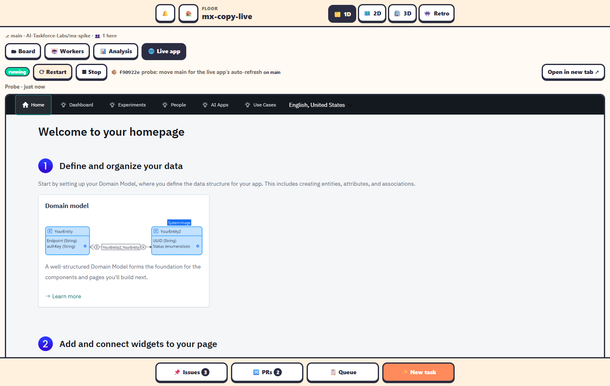

The **🌐 Live app** tab runs the floor's Mendix app from its `main` branch, on this laptop, and shows it in the page.

## Start, restart, stop

Only admins can start or stop it. Everyone else watches.

| Button | Does |
|---|---|
| **▶ Start** | Clones or updates the live checkout, builds and starts the app. |
| **⟳ Restart** | Stops and starts it again. |
| **■ Stop** | Stops it. |

The status pill shows *stopped*, *starting…*, *running*, *updating…*, *stopping…* or *failed*. When it runs you see `📦 sha subject on branch`, **Open in new tab ↗**, and the app itself.

Live apps don't start by themselves when the office starts. Open the tab and click **▶ Start**.

## How it works

- The office keeps a **separate clone** of the repository at `<office data>/live/<floor>`, always on `origin/main`. Agents' worktrees are never touched.
- It runs `mxcli run --local` with three free ports from **8110–8199** (app, admin and serve) and a database named `<floor>_live` in the local PostgreSQL.
- Once it's running, the office checks `main` every 60 seconds. When `main` moves (a merge), it **updates and restarts** the app by itself.
- When `main` moved, or a first build failed, it clears the stale build folders under `deployment/` (keeping `deployment/data`) and retries once.
- The log is `<office data>/live/<floor>.log`.

Settings such as the port range, the database and the mxcli path are environment variables `AGENT_OFFICE_LIVE_*`. See [Environment variables](../reference/environment-variables.md#live-app).

## When it fails

The tab shows *failed* with a note, the **🌐** item appears in Needs you, and the tab gets a `!` badge. See [Live app problems](../troubleshooting/live-app.md).
