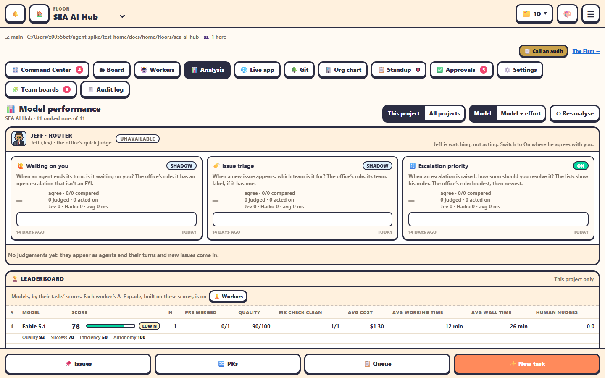

The **📊 Analysis** tab answers *which model should I use for this?* with numbers from your own runs.

## Controls

- **This project** or **All projects**.
- Group by **Model** or **Model + effort**.
- **↻ Re-analyse** (admin) records every worker again.

## 🏆 Leaderboard

One row per model: score, number of runs, PRs merged, quality, how often `mx check` came out clean, average cost, average working time, average wall time and human nudges. Each row breaks the score into its parts.

**How scores are computed**: Quality 35%, Success 30%, Efficiency 20%, Autonomy 15%.

## 🧩 Model × task type

A matrix of models against kinds of task. It shows, for example, which model does well on architecture and which on routine pages.

## 🕑 Recent runs

The last 25 runs with model, task, cost, time and outcome. Runs that can't be ranked are folded away.

## Jeff · Router

A section on Jeff, the office's quick judge:

- his status: **Jev live**, **on Haiku** or **unavailable**;
- one card per judgement, **🙋 Waiting on you** and **🏷️ Issue triage**: its mode (Off, Shadow, On), how often he agrees with the office's own rule, how many he judged and acted on, the Jev and Haiku split, his average latency, and 14 days of bars;
- **Recent disagreements**: when, which judgement, the subject, what Jeff said, what the rule said, and who answered (Jev or Haiku).

Switch a judgement to **On** once he agrees with you. See [Jeff · Router](../automation/jeff-router.md).

## What we have learned so far

In our runs, **Sonnet 5.5** gave the best value, **Opus 5.5** the highest quality, and **Haiku 4.5** struggled with Mendix work. Check your own numbers here. See [Models and costs](../teams-and-agents/models-and-costs.md).
