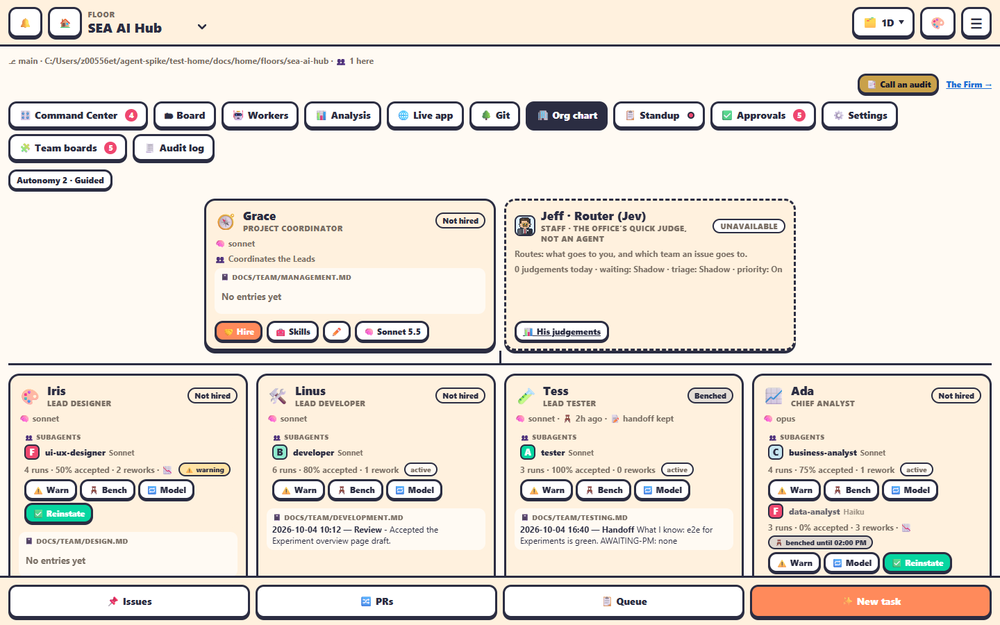

The **🏢 Org chart** tab shows the floor's team: the **Project Coordinator** and **Jeff · Router** on top, the four **Leads** below.

On top of the tab: an **Autonomy N · Name** chip (it opens Settings), and **💸 paused** when hiring is paused by the cost cap.

## A member's card

- Its icon, name, title and status.
- What it's doing now, and facts: **🧠 model · 💵 cost · ⏳ benched in N min · 🪑 benched for · 📝 handoff kept**.
- Its **subagents**, and its journal `📓 docs/team/<team>.md` with the latest entry.

## Actions

| Button | Who | Does |
|---|---|---|
| **🤝 Hire** | admin | Starts the member. Pick a **model** (Fable 5.1, Opus 5.5, Sonnet 5.5, Haiku 4.5) and an optional first task. |
| **⏰ Wake** | anyone | Wakes an asleep member in its saved session. |
| **🖥️ Terminal** | anyone | Opens its terminal. |
| **🧰 Skills** | admin edits | Its skills and gates. See [Skills and gates](../automation/skills.md). |
| **🪑 Bench** | admin | Asks it to write a handoff note, then clears its session. Only when it's idle or asleep. |
| **✏️** | admin | Renames it (up to 24 characters). |
| **🧠 model** | admin | Changes its model. Applies from the next hire. |

## Jeff's card

*Jeff · Router (Jev)*, *Staff · the office's quick judge, not an agent*. You can't hire or bench him. **📊 His judgements** opens the Analysis tab. See [Jeff · Router](../automation/jeff-router.md).

## Subagents

Each Lead's card lists its subagents:

- grade, name and model;
- *N runs · X% accepted · N reworks*, and 📉 when it underperforms;
- its state: *active*, *⚠️ warning* or *🪑 benched until HH:MM*.

Admin buttons: **⚠️ Warn**, **🪑 Bench**, **🔁 Model** (haiku, sonnet, opus, or the Lead's) and **✅ Reinstate**. See [Subagents](../automation/subagents.md).
