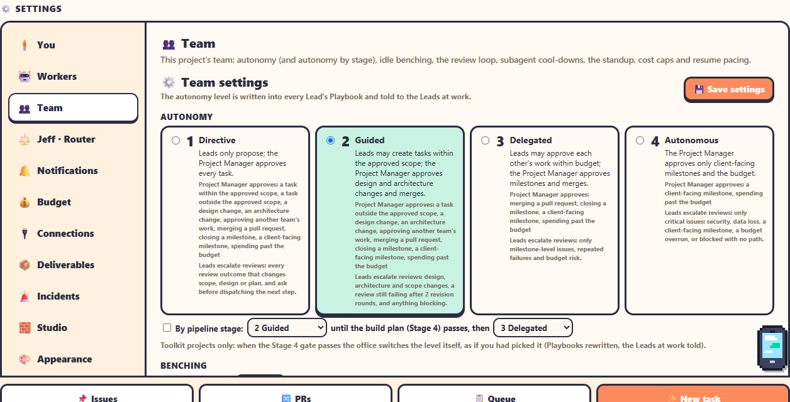

**⚙️ Settings** is a page of its own on the 1D view: its **⚙️ Settings** tab, `/lite?tab=settings`. The ☰ menu's **⚙️ Settings** opens it from the 1D view, the 2D view and `/home` alike, and so does every settings button and link in the office (Needs you's *Raise cap → Settings*, the team phone, Teams cards, the budget's suggestions, these docs): none of them switches to the 3D office. On a brand-new office with no project yet, `/home` opens it in a window instead.

The sections are down the left; pick one and the address follows (`&section=workers`), so a link can open any of them. Settings marked *Just you* are kept in this browser; *This floor* and *Everyone* are the office's, and only admins change those (everyone else sees them read-only). 🔌 Connections, 🧪 Testing and ⚠️ Danger zone are listed for admins only.

| Section | Link | What's in it |
|---|---|---|
| 🧍 **You** | [section=you](/lite?tab=settings&section=you) | Command Center terminal (Chat or Terminal), how you're signed in, and your sounds and voice chat (heard in the 3D office) |
| 🤖 **Workers** | [section=workers](/lite?tab=settings&section=workers) | Default worker, worker limit, keep awake while agents work, 🔁 restart safely, workers whose PR merged, the prompts |
| 👥 **Team** | [section=team](/lite?tab=settings&section=team) | This project's team settings (the table below, without Jeff and early drafts), and ▶ Resume project pacing |
| ⚖️ **Jeff · Router** | [section=jeff](/lite?tab=settings&section=jeff) | *Waiting on you*, *When to escalate*, *Triage*, *Priority* |
| 🔔 **Notifications** | [section=notify](/lite?tab=settings&section=notify) | Desktop notifications, the alarm when a worker needs you, phone alerts, Slack / Discord, Microsoft Teams |
| 💰 **Budget** | [section=budget](/lite?tab=settings&section=budget) | This project's budget, alert threshold, auto-pause and level; the office's default threshold and local currency (FX) |
| 🔌 **Connections** | [section=connections](/lite?tab=settings&section=connections) | Tokens, password, git & gh, phone access, folders, worktree cleanup (admins; also ☰ → 🔌 Connections) |
| 📦 **Deliverables** | [section=deliverables](/lite?tab=settings&section=deliverables) | Early drafts |
| 🚨 **Incidents** | [section=incidents](/lite?tab=settings&section=incidents) | The detection rules and the dedupe window (admins edit them) |
| 🧱 **Studio** | [section=studio](/lite?tab=settings&section=studio) | Studio mode now, and Open in Studio Pro (admins) |
| 🎨 **Appearance** | [section=appearance](/lite?tab=settings&section=appearance) | Your color theme (Default, Dark, Terminal, Clean Light/Dark), the building's holiday theme and map |
| 🛠️ **Advanced** | [section=advanced](/lite?tab=settings&section=advanced) | Workspace folder, the sky's clock, the office dog, where the settings files are |
| 🧪 **Testing** | [section=testing](/lite?tab=settings&section=testing) | Admins only: whether this office is in test mode and why, and the way to the [Test Mode page](../administration/test-mode-page.md) |
| ⚠️ **Danger zone** | [section=danger](/lite?tab=settings&section=danger) | Admins only: Remove this project from the office, or delete it (its folder and GitHub repository too, if you tick them). See [Delete or remove a project](delete-project.md) |

The 3D office keeps its own **☰ → ⚙️ Settings** window for when you're in it: the camera and your character, which only it has, plus the same Workers, Notifications, sound and building sections (they're built from the same parts), and an *All settings ↗* link to this page.

## The team settings

Under 👥 Team, ⚖️ Jeff · Router and 📦 Deliverables. Only admins can change them. Click **💾 Save settings** when done (it saves all three).

| Section | Setting | Default |
|---|---|---|
| **Autonomy** | 1 Directive · 2 Guided · 3 Delegated · 4 Autonomous | **2 Guided** |
| **Autonomy** | By pipeline stage: one level until the build plan (Stage 4) passes, another after | **Off** (2 Guided, then 3 Delegated, when on) |
| **Benching** | Bench a Lead after N idle minutes (0 = only by hand) | **0** (off) |
| **Review loop** | Nudge a Lead to review its subagent's result | **On** |
| **Deliverables** | Early drafts while the Chief Analyst is on Stages 0–2 | **On** |
| **Subagents** | Reinstate a benched subagent after N hours (0 = only by hand) | **24** |
| **Daily standup** | Scheduled · time · time zone · days | **On, 09:00, Asia/Singapore, Mon–Fri** |
| **Daily cost cap** | A dollar cap for each autonomy level | **Blank** (no cap) |
| **Issues** | Dry run: record approvals without making GitHub issues | **Off** |
| **Jeff · Router** | *Waiting on you* and *Triage*: Off · Shadow · On; *Priority*: Off · On; *When to escalate*: Only a real ask · His say-so | **Shadow, Shadow, On, Only a real ask** |

Under 🧍 **You**: **Command Center terminal**, *Chat (default)* or *Terminal*, the view the [Project Coordinator console](command-center.md#the-project-coordinator-console) opens in. Anyone can change it, it applies at once (no 💾 Save), and it's kept in this browser only.

## What each one does

- **Autonomy** sets how often agents need you. Changing it rewrites every hired member's Playbook and tells the ones at work. See [Autonomy levels](../teams-and-agents/autonomy.md).
- **By pipeline stage** (toolkit projects only) lets the office pick the level: the first one until the Stage 4 gate passes, the second from then on, changed as if you had picked it. While it's on, the level buttons only show the level. See [Autonomy by pipeline stage](../teams-and-agents/autonomy.md#autonomy-by-pipeline-stage).
- **Benching** is **off by default**: Leads are benched only when you click 🪑 Bench. Set a number of minutes to bench idle Leads automatically. See [Benching and handoffs](../teams-and-agents/benching-and-handoffs.md).
- **Review loop**: when a Lead's turn ends right after one of its subagents came back, the office prompts it once to review the result. See [The review loop](../teams-and-agents/review-loop.md).
- **Deliverables → Early drafts**: while the Chief Analyst is still on Stages 0–2, Design, Development and Testing make small drafts marked as drafts (low-fi wireframes, a draft domain model and architecture sketch, a test-plan outline), to revise once the BRDs are confirmed. Off: they wait for their stage. Changing it rewrites the hired Leads' Playbooks. See [Deliverables](deliverables.md#early-drafts).
- **Subagents**: how long a benched subagent sits out. See [Subagents](../automation/subagents.md).
- **Daily standup**: see [Standup](standup.md).
- **Daily cost cap**: one cap per autonomy level, for this floor. Only the cap for the current level counts. When it's spent, hiring stops on this floor until midnight (in the standup's time zone). See [Models and costs](../teams-and-agents/models-and-costs.md).
- **Dry run**: approved proposals are recorded, but no GitHub issue is made. Good for trying the office out. `AGENT_OFFICE_TEAMS_DRY_RUN=1` turns it on for the whole office.
- **Jeff · Router**: *Waiting on you* (when an agent ends its turn: is it waiting on you? On: he escalates it if it didn't), *Triage* (which team is a new issue for? On: he labels unlabelled issues he's sure about), and *Priority* (how soon should you resolve each escalation? On: your escalations are listed in his order, #1 first). *When to escalate* says what it takes for *Waiting on you* to raise one: by default his verdict *and* a real ask at the end of the agent's message, or his verdict alone. See [Jeff · Router](../automation/jeff-router.md#when-he-escalates).

All fields with their exact names and limits: [Settings reference](../reference/settings-reference.md).

## Teams, keep-awake and restarting safely

Three settings for the whole office. Admins change them; everyone sees them.

- **🔔 Notifications → Microsoft Teams** ([section=notify](/lite?tab=settings&section=notify)): the Teams Workflows webhook (masked once saved), **📨 Send a test card**, which floors post, *Needs you only* or *Needs you + daily digest*, quiet hours, a pause (1, 4 or 12 hours) and the public office address for each card's Open button. See [Teams notifications](../integrations/teams-notifications.md).
- **🤖 Workers → 🔁 Restart safely** ([section=workers](/lite?tab=settings&section=workers), admins): pauses every project, waits until no agent is mid-turn (with a timeout: keep waiting, restart anyway, or cancel), optionally runs `npm run build` when the office's checkout has new commits, then restarts through the launcher's loop. The floors it paused are resumed when the office is back. See [Releasing and restarting safely](../administration/running-the-office.md#releasing-and-restarting-safely).
- **🤖 Workers → Keep awake while agents work** (on by default): the computer doesn't sleep while any worker on any floor is working or a queued task, Firm audit or gate-check runs, and may again once everything has been idle for the set minutes (10). It says what it's doing (*Keeping this computer awake: 3 agents working*) and how to set *When I close the lid* to *Do nothing* so work carries on with the lid closed. See [Running the office](../administration/running-the-office.md#keep-it-awake-and-the-lid).
