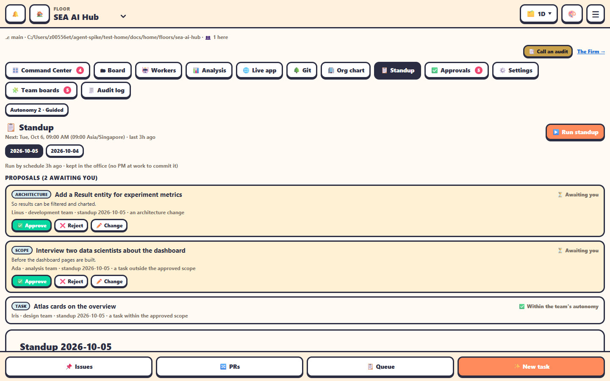

The **📋 Standup** tab shows the team's daily standup and the **proposals** in it.

## When it runs

- By default on **weekdays at 09:00, Asia/Singapore time**, and only if there was activity on the floor since the last one. Change it in [Settings](settings.md).
- On demand: **▶️ Run standup** on this tab, or the **📋 Run standup** chip on the Command Center.
- If the office was down at standup time for more than 12 hours, that standup is skipped.
- A team hired **after** today's standup time gets no catch-up standup that day: its first is the next scheduled one.

The tab shows *Next: &lt;when&gt;*, or that the daily standup is off.

## How it's put together

1. Leads that are awake, between turns and not waiting on someone are asked live for **done**, **next**, **blockers** and **proposals**, in their journal. The ask ends with *When you've done this, carry on with: &lt;their task&gt;*, so answering isn't the end of their work. The others are summarised from their journal.
   - The **scheduled** standup never interrupts a Lead mid-turn: a busy one is read from its journal.
   - When **you** run it and someone is busy, a small window asks first, per person or the same for all: **Interrupt now**, **After their current turn** (the default: asked once that turn ends) or **Skip: use their journal**. See [Interruptions and back to work](../teams-and-agents/interruptions.md).
2. The Chief Analyst also gets the analysis numbers and writes the weekly insight memo `docs/insights/YYYY-Www.md` if it's missing.
3. After up to 20 minutes the office writes `docs/standups/<date>.md` and hands it to the Project Coordinator to summarise and commit.

## Proposals

Each proposal under *Proposals* becomes a card: **✅ Approve**, **❌ Reject** or **✏️ Change**.

- **Approve** opens a GitHub issue labelled `team:<team>` (unless dry run is on).
- If your autonomy level already allows that kind of decision, the proposal is approved automatically.
- Your decisions go back to the Coordinator a minute after your last one, and each to the Lead that proposed it, as one short note between its turns, within ten seconds (an asleep Lead is woken for it: it was waiting on your decision). A Lead mid-turn hears it when the turn ends. Both wait through a restart: they're kept in the roster file until they're delivered.

Pending proposals also show on [Approvals](approvals.md).
