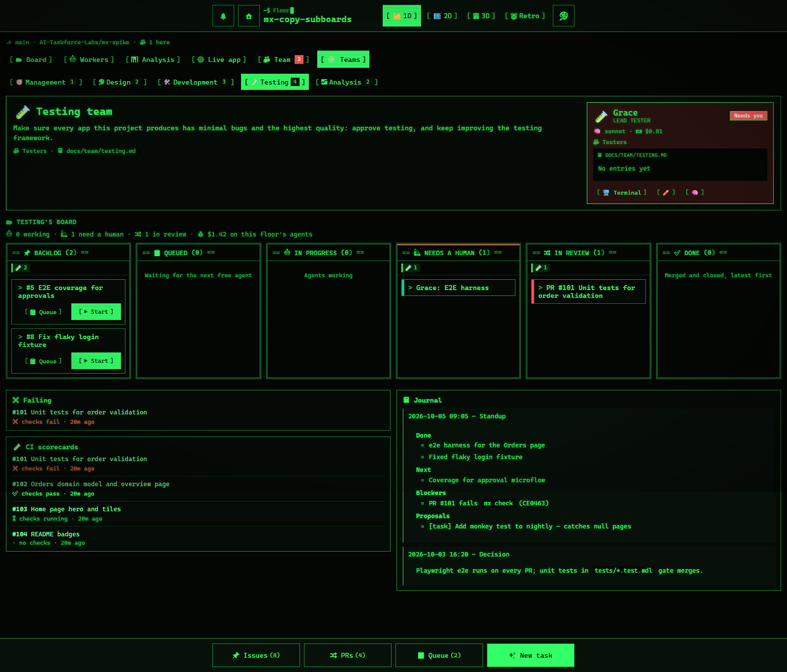

The **🧩 Team boards** tab has a page for each of the five teams. Switch between them at the top, or link to one with `&tab=teams&team=testing`.

Each team page has:

- the team's name, **mission**, subagents and journal path (`docs/team/<team>.md`);
- the **Lead's card** from the org chart;
- **🗂 &lt;Team&gt;'s board**: only that team's cards;
- **👥 Subagents** with their grades, and **📓 Journal** with the latest entries;
- **💬 Team chatter**: a short version of the Command Center's [thread](command-center.md#team-chatter), with what this team said and was told.

And panels for what each team cares about:

| Team | Panels |
|---|---|
| 🧭 Management | 📋 Latest standup · ✅ Approvals |
| 🎨 Design | ✅ Design approvals · 🖼️ Design artifacts |
| 🛠️ Development | 🌐 Live app · 🔀 Development PRs |
| 🧪 Testing | ❌ Failing · 🧪 CI scorecards |
| 📈 Analysis | 📑 BRD & insight memos · 📊 Model ranking on this floor |

A card belongs to a team through its `team:` label. Leads add `--label team:<team>` when they open a PR, and the office adds it to a Lead's PR that has none.
