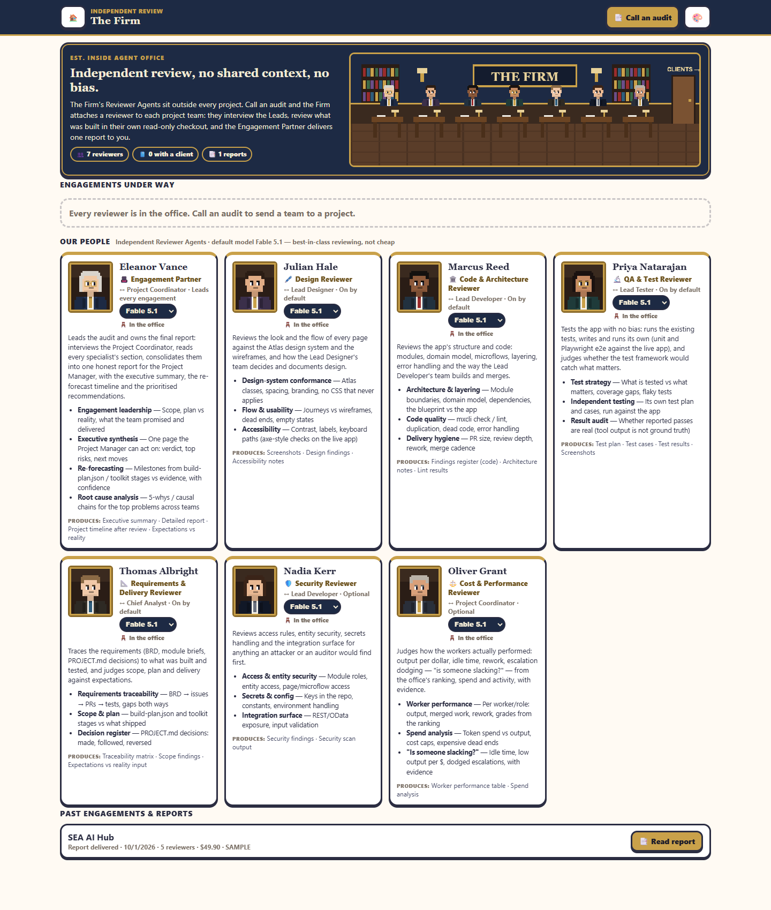
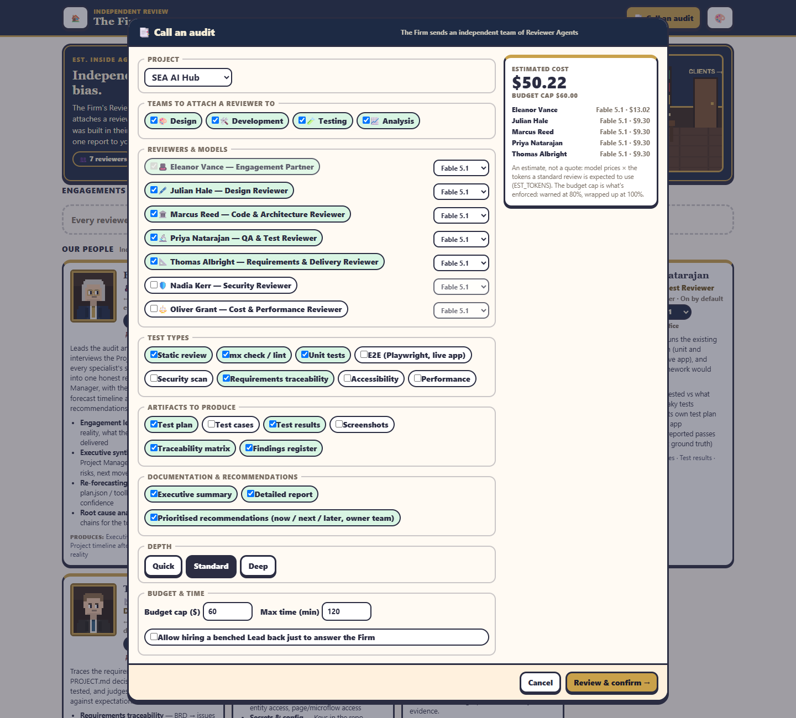
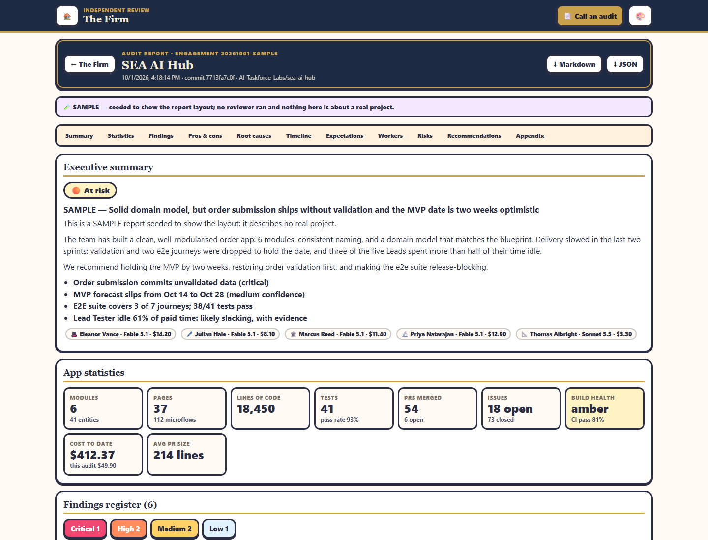

**🏛️ The Firm** is an independent audit firm inside the office. Its **Reviewer Agents** sit *outside* every project team and check the team's work the way an external auditor would. They report to you, the Project Manager, not to the team.



```text
                    You: the PROJECT MANAGER
                 ▲                          ▲
     audit report│                          │escalations, approvals
                 │                          │
  🏛️ THE FIRM (outside the project)    🧭 Project Coordinator + 4 Leads
  Engagement Partner + reviewers ──interviews──▶  (the project team)
  isolated clone at a pinned commit, budget cap
```

## Where to find it

- **/firm**, its own page like `/home`: from **📑 The Firm** on [/home](home.md)'s top bar.
- On a project's [Command Center](command-center.md), a slim strip under the top bar: **📑 Call an audit** and **The Firm →** when nothing is running; *The Firm is auditing this project: 5 reviewers · $12.40 of $60 · Interviews & review* while an audit runs; **📑 Audit report ready from The Firm → Read** when it's done. The report also shows in **Needs you**.

## The people

| Reviewer | Attached to | Staffing | Checks |
|---|---|---|---|
| 🎩 Eleanor Vance, **Engagement Partner** | Project Coordinator | every engagement | scope, plan vs reality, re-forecast, root causes; owns the final report |
| 🖋️ Julian Hale, **Design Reviewer** | Lead Designer | on by default | Atlas conformance, flows, accessibility |
| 🏛️ Marcus Reed, **Code & Architecture Reviewer** | Lead Developer | on by default | layering, `mxcli check` / lint, delivery hygiene |
| 🔬 Priya Natarajan, **QA & Test Reviewer** | Lead Tester | on by default | test strategy, her own unit and Playwright tests, whether reported passes are real |
| 📐 Thomas Albright, **Requirements & Delivery Reviewer** | Chief Analyst | on by default | BRD traceability, scope and plan, the decision register |
| 🛡️ Nadia Kerr, **Security Reviewer** | Lead Developer | optional | access rules, secrets, the integration surface |
| ⚖️ Oliver Grant, **Cost & Performance Reviewer** | Project Coordinator | optional | worker performance, spend, *is someone slacking?* |

Each card under **Our people** shows the reviewer's portrait, what they check and produce, whether they are *In the office* or with a client, and their model. Admins can change a reviewer's default model (Fable 5.1, Opus or Sonnet) on the card.

## Call an audit

**📑 Call an audit** (on `/firm` or a project's Command Center) opens the wizard. Only the Project Manager (an admin) can call one.



| Section | What you choose |
|---|---|
| **Project** | The floor to audit. |
| **Teams to attach a reviewer to** | Design, Development, Testing, Analysis. |
| **Reviewers & models** | Who goes (the Engagement Partner always does) and each one's model. |
| **Test types** | Static review, mx check / lint, Unit tests, E2E (Playwright, live app), Security scan, Requirements traceability, Accessibility, Performance. |
| **Artifacts to produce** | Test plan, Test cases, Test results, Screenshots, Traceability matrix, Findings register. |
| **Documentation & recommendations** | Executive summary, Detailed report, Prioritised recommendations (now / next / later, owner team). |
| **Depth** | **Quick**, **Standard** or **Deep**: how long they dig and how many questions they may ask. |
| **Budget & time** | **Budget cap ($)**, **Max time (min)**, and *Allow hiring a benched Lead back just to answer the Firm*. |

The **Estimated cost** box on the right adds up each reviewer's model price × the tokens a review of that depth is expected to use. It is an estimate, not a quote: the **budget cap** is what's enforced. **Review & confirm →** shows a last summary before the audit starts.

> [!TIP]
> Try your first real audit with **Quick** depth, two reviewers and a small cap (for example $10). Fable 5.1 costs $10 / $50 per million input / output tokens.

## How an engagement runs

1. **Requested**, then **Staffing**: the commit is pinned (the project branch on `origin`, else `HEAD`) and each reviewer gets its own folder.
2. **Interviews & review** (fieldwork): every reviewer runs at the same time as a headless Claude Code session. They review the code and interview their Lead.
3. **Partner consolidating**: the specialists' sections go to the Engagement Partner, who writes the report.
4. **Report delivered**: the report is saved, a toast goes to the floor, Needs you says **📑 Audit report ready**, and every reviewer session stops.

You can **cancel** at any time (no report). A restart of the office carries running reviewers on in fresh turns; an engagement caught while staffing fails and can be called again.

## Isolation: no shared context, no bias

- Each reviewer works in a **local clone at the pinned commit**, detached, with **no remote** and no credential helper. It can't push.
- The project's agent instructions (`CLAUDE.md`, `AGENTS.md`, `.claude/`, `.mcp.json` and the like) are **moved out** of the clone into its evidence, so the reviewer isn't steered by the team's own prompts. The team journals stay, as evidence.
- Its environment has no GitHub tokens, SSH agent, credential manager or the office's worker tokens. Deny rules block `git push`, GitHub writes, `gh api`, and reading `~/.agent-office*` and `~/.ssh`.
- No MCP servers and no web tools. A reviewer isn't a floor worker: no desk, not in `workers.json`, not in the Leads' `office-workers list`, never benched.

> [!NOTE]
> A reviewer still runs as your Windows user. The deny rules, not the operating system, keep it inside its folder, and your global Claude Code settings still apply.

## Interviews

- A reviewer asks with `office-workers firm ask [--team <team>] "question"`. Specialists ask their own Lead; the Engagement Partner asks the Project Coordinator or any attached Lead.
- The question reaches the Lead's session (woken if asleep) as *"📋 The Firm's … (independent audit) asks: …"*. The Lead answers with `office-workers firm answer <id> "answer"`, and the answer comes back as the reviewer's next prompt.
- A benched Lead's question goes to the Project Coordinator, or the Lead is hired back if you allowed it. Unanswered after 20 minutes, the reviewer is told and moves on.
- Questions per reviewer: **Quick** 3 (1 open at a time), **Standard** 6 (2 open), **Deep** 12 (3 open).

## Budget and time

Every turn is priced from the office's price table and added to the office's spend. At **80 %** of the cap the floor is warned (a toast and a Needs-you item). At **100 %** every running turn is cut short and each reviewer is asked to send what it has; 6 minutes later, or at 115 % of the cap, everything stops and a **partial** report is delivered. **Max time** wraps up the same way.

## The report



The report opens at `/firm?report=<id>`, with a section bar:

- **Summary**: a verdict (for example *At risk*), the headline, the top points, and each reviewer with model and cost.
- **Statistics**: modules, pages, lines of code, tests and pass rate, PRs merged, issues, build health, cost to date and this audit's cost. The office fills in what it knows (PRs, issues, CI pass rate, spend, ranking grades).
- **Findings** (a register by severity: Critical, High, Medium, Low), **Pros & cons**, **Root causes**, **Timeline** (a re-forecast), **Expectations** vs reality, **Workers** (performance, with *slacking?* flags and evidence), **Risks**, **Recommendations** and an **Appendix**.

Admins can download it as **⬇ Markdown** or **⬇ JSON**.

## Where it's kept

Under the office's data folder, in `firm/`: `firm.json` (each reviewer's model and the defaults), `engagements/<id>/` (one audit and its reviewers' folders) and `reports/<id>.json` and `.md`. See [Data locations](../administration/data-locations.md). The Firm reads the [Audit log](audit-log.md) as evidence and records its own steps there (as *Reviewer*).

## Related

- [Audit log](audit-log.md) · [Workers and rankings](workers.md) · [Models and costs](../teams-and-agents/models-and-costs.md)
- Commands: [office-workers CLI](../reference/office-workers-cli.md#the-firm) · Routes: [API endpoints](../reference/api-endpoints.md)
