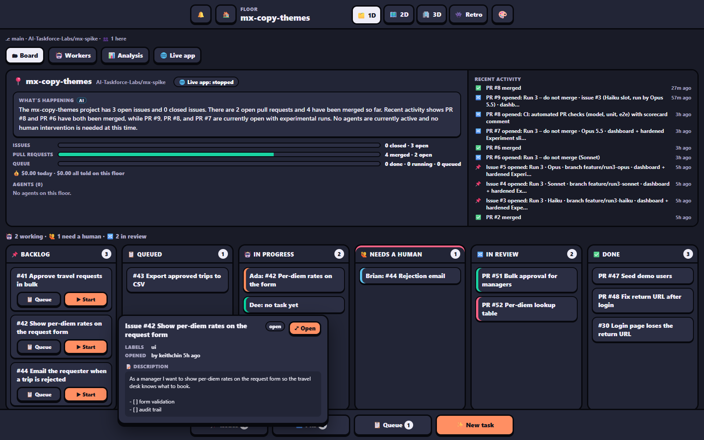
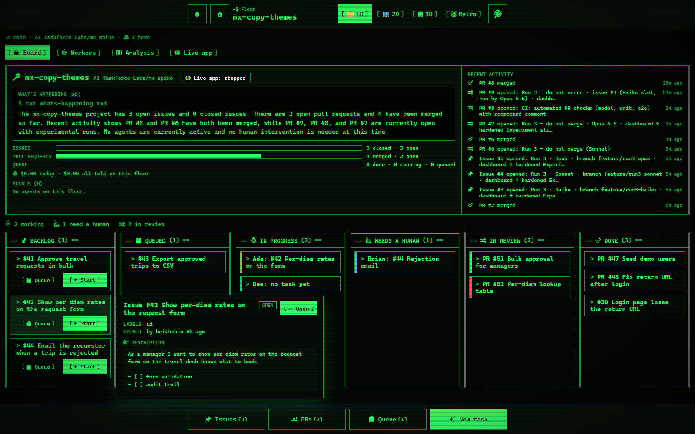

## The top bar

On the 1D and 2D views, from left to right:

| Part | What it does |
|---|---|
| 🔔 | *Turn on notifications*. Shown until your browser has been asked once. Desktop notifications take you to the worker that needs you. |
| 🏠 | Goes to `/home`. |
| **Floor** picker | Switches project. Each option shows `· 🙋 N` when agents there wait on you, or clone progress while a floor is cloning. Under the bar: `⎇ branch · repo/dir · 👥 N here`. |
| **View** dropdown | 🗂️ 1D, 🗺️ 2D, 🏢 3D, 👾 Retro. ↑/↓/Home/End move, Enter or Space picks, Esc closes. |
| 🎨 | Steps through the color themes. |
| ☰ | The menu. |

When agents wait on another floor, buttons like **🙋 2 waiting on travel-approval →** appear under the bar. They land on that floor's Command Center.

The browser tab's title counts the workers waiting on you, so you see it from other tabs too.

## Color themes

Click **🎨** and pick one from the list:

- **Default**: the office's own warm light look.
- **Dark**: dark blue-grey, easy on the eyes at night.
- **Terminal**: black and phosphor green, one monospace font, square boxes and faint scanlines. In Terminal, the project summary's *What's happening* types itself out (not if you asked your system for less motion).
- **Clean (Light)** and **Clean (Dark)**: plain and quiet, like VS Code's classic light and dark themes. Neutral greys with a blue accent, a sans-serif font at 13px with a strict type scale and nothing heavier than semi-bold, 2–4px corners and 1px borders, flat buttons and VS Code-style tabs. **No emoji**: they're hidden everywhere, and buttons that were only an emoji (🔔 🏠 🎨 ☰) show line icons instead. The 2D office is barely tinted in Clean (Light) and a neutral grey night in Clean (Dark).

The pick is kept in this browser (`agent-office.color-theme` in local storage). It applies to the 1D view, the 2D view (the office is tinted to match), `/home`, The Firm and these docs, and follows along in your other open tabs. Without a pick, it follows your system's dark mode. The 3D office keeps its own look.

## The ☰ menu

The same menu as in the 3D office, with what each item does from here.

| Section | Items |
|---|---|
| **Open** | 🙋 Next worker that needs you (only when someone waits) · 📌 Issues · 🔀 Pull requests · 📋 Task queue · 🌐 Services · 📝 Whiteboard · 🤝 Meeting room · 🔎 Search · 📚 Project docs · 🛗 Floors · 🍸 Rooftop bar (3D ↗) |
| **Together** | 🎙️ Join voice (3D ↗) · 🖥️ Share screen (3D ↗) · 🖼️ Hang a picture (3D ↗) · 👥 Invite teammates · 🔑 Accounts (admin) · 🔐 Your sign-ins |
| **Office** | ⚙️ Settings (3D ↗) · 🏠 Home · 📖 Documentation · ⬆️ Upgrade the office (when an update is there) |

- Items marked **3D ↗** open the 3D office and run there.
- **📚 Project docs** opens the floor's own Markdown files (its README, `docs/team/*.md`, standups) on the bookshelf.
- **📖 Documentation** opens these docs.
- Red numbers are counts: open issues, open PRs, queued tasks, people waiting on other floors.
- On `/home`, the items that need a floor are left out.

> [!NOTE]
> **⚙️ Settings** in the ☰ menu is the 3D office's own settings window (you, sound, notifications, the building). A project's team settings are on the 1D view's **⚙️ Settings** tab. See [Settings](settings.md).

## Tab badges

| Tab | Badge |
|---|---|
| 🎛️ Command Center | How many items are in Needs you. |
| 🗂 Board | Cards in 🙋 Needs a human. |
| 🤖 Workers | Workers waiting on you. |
| 📋 Standup | A dot when there's a standup you haven't seen. |
| 🌐 Live app | `!` when it failed. |
| ✅ Approvals | Items waiting for you. |
| 🧩 Team boards | Approvals plus escalations. |

## The bottom bar (1D)

**📌 Issues**, **🔀 PRs** and **📋 Queue** with their counts, and **✨ New task** to give a task to a new worker.
