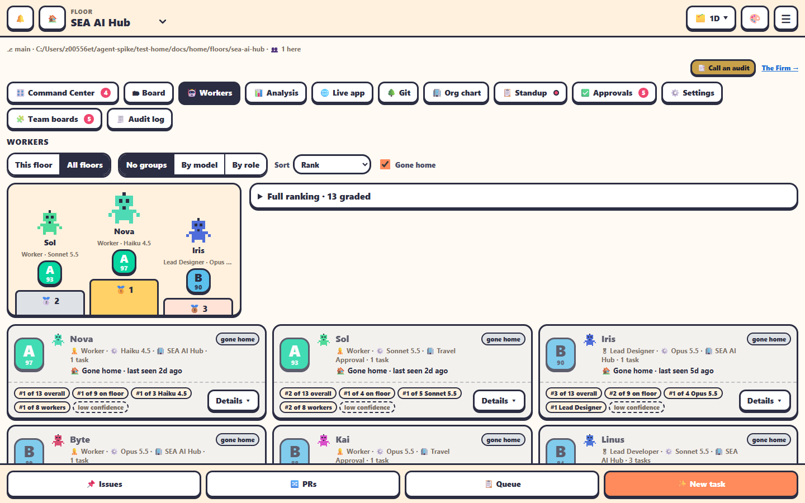

The **🤖 Workers** tab shows every agent on the floor, or on all floors, ranked by a grade from **A** to **F**.

## The toolbar

| Control | Choices |
|---|---|
| Scope | **This floor** or **All floors** |
| Group by | No groups · **By model** · **By role** |
| Sort | Needs you first · Rank · Name · Recent |
| ☐ Gone home | Also show workers who went home |
| ☑ Show subagents | The Leads' subagents, each after its Lead (on by default) |
| ☐ Include never-run | With Show subagents, also the ones that have never run (off by default) |

Your choices are kept in this browser.

## What you see

- A **podium** with the top three (🥇🥈🥉).
- **Full ranking**: rank, grade, worker, role, model, floor (with All floors), score, trend and tasks.
- With grouping: a card per model or role with its average grade and its spread of A–F.
- Each worker's **card**: its grade, its live card (open the terminal, ✍️ prompt it), its rank on the floor, for its model and for its role, the trend (▲▼) and how sure the grade is.
- **Details ▾**: highlights (🏆), the standard criteria and, for team roles, their duties.

## Subagents

Each Lead's [subagents](../automation/subagents.md) get a card of their own, right after their Lead's: **🧩 tester · hired by Hedy (Lead Tester)**, with

- its grade A–F (from its Lead's reviews, not the worker criteria below),
- how it is now: **🔨 working** on what and for how long (and how many more runs of it are going at once), **💤 idle** with when it last ran and on what, or **🪑 benched** and why,
- its model, its runs (👀 how many its Lead hasn't reviewed yet), and ⚠️ on warning or 📉 underperforming.

A subagent that has never run has no card unless you tick **Include never-run**; it shows by itself while it's at work for the first time, and when it's benched or on warning.

A Lead that isn't at work on this floor has its subagents in a group at the end. Click a card for its detail: what it's on, its recent runs (how long, how each ended, the Lead's verdict), the Lead's reviews, and **💬 Open** *Lead* (a subagent works inside its Lead's Claude Code session, so its work shows in the Lead's terminal and Chat view). The Project Manager gets **⚠️ Warn**, **🪑 Bench**, **🔁 Model** and **✅ Reinstate** there too. Subagents aren't hired or sent home like workers: their Lead sends them off.

## How the grade is worked out

Grades: **A** ≥ 90, **B** ≥ 80, **C** ≥ 70, **D** ≥ 60, otherwise **F**.

**Standard criteria**, for every worker:

| Criterion | Weight |
|---|---|
| Model benchmark | 25% |
| Delivery | 30% |
| Autonomy | 25% |
| Token efficiency | 20% |

**Specialist duties** count for 30% of a team role's score:

| Role | Duties |
|---|---|
| 🧭 Project Coordinator | Plan upkeep · Standups on time · Escalation summaries · Leads unblocked · Questions batched |
| Every Lead | Review turnaround · Review quality · Escalation precision · Team throughput · Journal & handoffs |
| 🎨 Lead Designer | + Design reviews |
| 🛠️ Lead Developer | + Build health |
| 🧪 Lead Tester | + Tests & bugs caught |
| 📈 Chief Analyst | + Decisions & gates |

A Lead's **review turnaround** and **review quality** come from the reviews it records for its subagents (`office-workers subagent review`). See [Subagents](../automation/subagents.md).

**ℹ️ How workers are graded** on the tab explains this in the app too.

> [!NOTE]
> Highlights can be written by an LLM. Set `AGENT_OFFICE_RANKING_LLM=off` to keep them to the office's own records. See [Environment variables](../reference/environment-variables.md).
